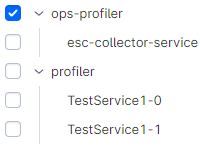
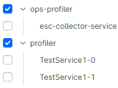
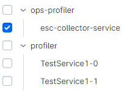
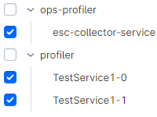
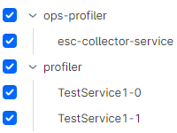

# API

CDT provides APIs for provide routing API for external apps for parameters to search. 
With the help of this functionality, when you open a searched link from the browser bar, the search will start automatically and another user will immediately receive the desired results. 

However, there is a limitation in the lifespan of the data (approximately 2 weeks). If the data has been deleted, the search will not return anything. Also, the link may not work if its length is more than `2000` characters (depending on the browser).

## API options

### Date, queries, duration

#### Calls page

| Number on screen | Name         | Description                     | Example in URL           | Value                                                                                      |
|:----------------:|:-------------|:--------------------------------|--------------------------|:-------------------------------------------------------------------------------------------|
|        1         | `dateFrom`   | Date value from DatePicker      | `dateFrom=1700049646640` | The date is converted to Unix time                                                         |
|        2         | `dateTo`     | Date value from DatePicker 'To' | `dateTo=1700053246641`   | The date is converted to Unix time                                                         |
|        3         | `callQuery`  | Query from calls page           | `callsQuery=void`        | Content of the request. See [HTML escaping](#HTML-escaping)                                |
|        4         | `duration`   | Duration from calls page        | `callsDuration=5000`     | The value represents the number of `milliseconds`. When selecting "all", the quantity is 0 |
|        5         | `services`   | Selected services               | `services=profiler`      | See [services](#Services)                                                                  |

#### Calls-tree page

| Number on screen | Name                         | Description                            | Example in URL  | Value                                                  |
|:----------------:|:-----------------------------|:---------------------------------------|-----------------|:-------------------------------------------------------|
|        1         | `callsTreeTable`             | Widget for calls-tree                  |                 |                                                        |
|        2         | `callsQuery`                 | Query for search in calls-tree         | `callsQuery=50` | Searched words are highlighted in the calls-tree table |
|        3         | `paramsButton`               | Button for popup with calls parameters |                 |                                                        |
|        4         | `traceButton`                | Button for popup with stack-trace      |                 |                                                        |
|        5         | `callStatsTable`             | Widget for common/call statistics      |                 |                                                        |
|        6         | `callsTreeAddWidgetDropdown` | Menu for adding widgets on the page    |                 |                                                        |
|        7         | `callsTreeDownloadButton`    | Button for downloading static page     |                 |                                                        |

#### Pods info

| Number on screen | Name         | Description                     | Example in URL                     | Value                                                        |
|:----------------:|:-------------|:--------------------------------|------------------------------------|:-------------------------------------------------------------|
|        1         | `dateFrom`   | Date value from DatePicker      | `dateFrom=1700049646640`           | The date is converted to Unix time                           |
|        2         | `dateTo`     | Date value from DatePicker 'To' | `dateTo=1700053246641`             | The date is converted to Unix time                           |
|        3         | `podsQuery`  | Query from pods info page       | `podsInfo=profiler`                | Content of the request. See [HTML-escaping](#HTML-escaping)  |
|        4         | `services`   | Selected services               | `services=profiler%2Cops-profiler` | See [services](#Services)                                    |

#### Heap dumps

| Number on screen | Name        | Description                     | Example in URL                     | Value                                                       |
|:----------------:|:------------|:--------------------------------|------------------------------------|:------------------------------------------------------------|
|        1         | `dateFrom`  | Date value from DatePicker      | `dateFrom=1700049646640`           | The date is converted to Unix time                          |
|        2         | `dateTo`    | Date value from DatePicker 'To' | `dateTo=1700053246641`             | The date is converted to Unix time                          |
|        3         | `services`  | Selected services               | `services=profiler%2Cops-profiler` | See [services](#Services)                                   |

##### Services

Services can also be represented in the URL parameter.

Now each service is selected separately. In this case, there may be several scenarios:

| Scenario                              | Request                                                                                                                | Image                                                        | URL value                                                                                                                         |
|---------------------------------------|------------------------------------------------------------------------------------------------------------------------|--------------------------------------------------------------|-----------------------------------------------------------------------------------------------------------------------------------|
| One namespace is selected             | All services of this namespace will be selected in the request                                                         |           | `services=ops-profiler`                                                                                                           |
| Several namespaces have been selected | Then all services of these namespaces will be selected in the request                                                  |  | `services=ops-profiler%2Cprofiler`                                                                                                |
| One service is selected               | Then the request will contain only this service with an explicit indication of its namespace                           |              | `services=ops-profiler%7Cesc-collector-service `                                                                                  |
| Several services have been selected   | Then the request will contain all the selected services and each will have a namespace indicated                       |      | `services=ops-profiler%7Cesc-collector-service%2Cprofiler%7CTestService1-0%2Cprofiler%7CTestService1-1`                           |
| All are selected                      | All namespace services will be selected once in the request, however, all selected elements will be listed in the URL  |                               | `services=ops-profiler%7Cesc-collector-service%2Cprofiler%7CTestService1-0%2Cprofiler%7CTestService1-1%2Cprofiler%2Cops-profiler` |

##### HTML-escaping

when using various symbols, for example `,|$! and etc.`, these characters are encoded in html. 
Below are examples of the initial string and its display in the url

| Initial string                                           | URL                                                            |
|:---------------------------------------------------------|----------------------------------------------------------------|
| `com.netcracker.cdt `                                    | `com.netcracker.cdt`                                           |
| `main(java.lang.String[])`                               | `main%28java.lang.String%5B%5D%29`                             |
| `void com.netcracker.cdt (UiServiceApplication.java:58)` | `void+com.netcracker.cdt+%28UiServiceApplication.java%3A58%29` |

