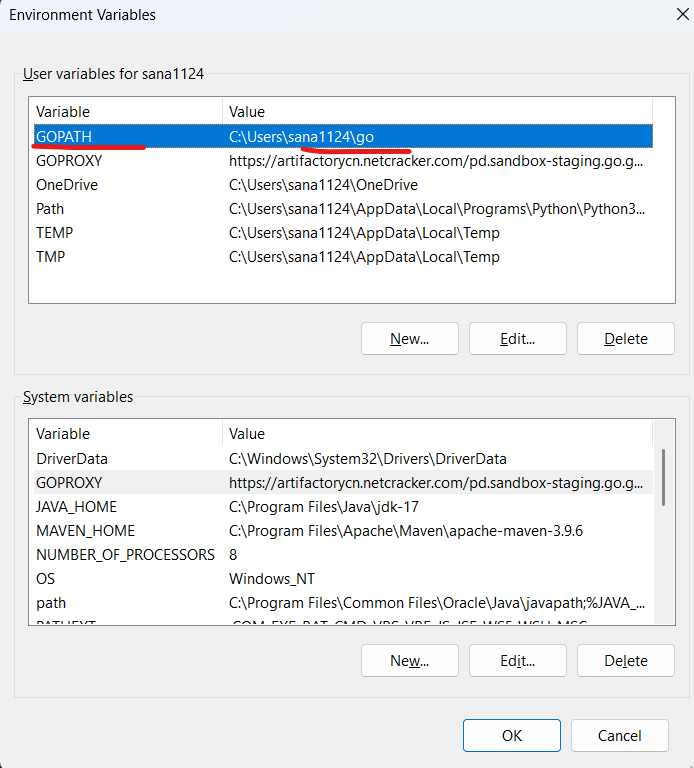
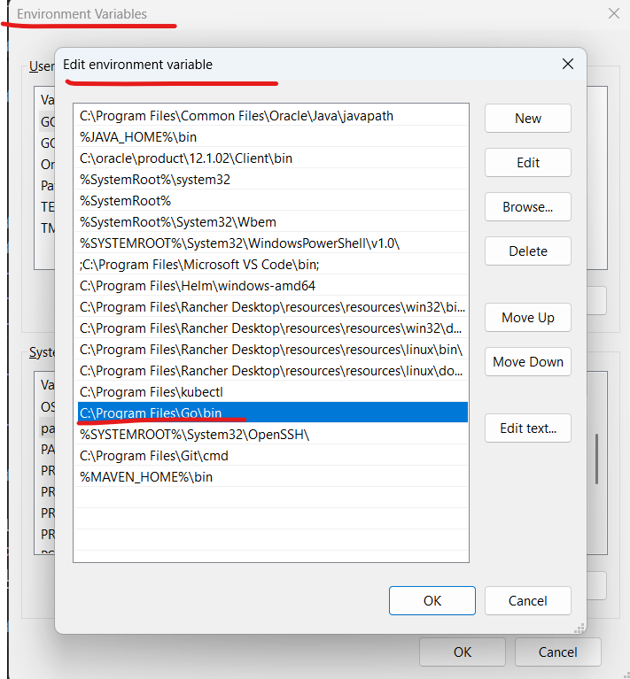

# How to set up and launch Cloud Maintenance Job on Local system

## Table of Content

- [Introduction](#introduction)
- [Prerequisites](#prerequisites)
- [Environment setup](#environment-setup)
  - [GoLang Windows setup](#golang-windows-setup)
  - [GoLang Wsl setup](#golang-wsl-setup)
  - [Cloud Maintenance Job Repository](#cloud-maintenance-job-repository)
  - [Postgres and Minio Local Setup](#postgres-and-minio-local-setup)
  - [VS Code Setup](#vs-code-setup)

## Introduction

This guide will help user to set up the environment on their machine. It will provide step-by-step instructions to run
the Cloud Maintenance Job locally.

## Prerequisites

- GoLang >= 22
- IntelliJ IDEA or VS code Setup
- Wsl 2 if want to use ubuntu Wsl on Windows
- Rancher Desktop or similar Containerization tool

## Environment setup

### GoLang Windows setup

- Install golang from [go.dev](https://go.dev/doc/install) official site.
- Set Windows environment variable.
- Set `GOPATH` in user variable, it's your working code directory path until `go` directory:

  
- Update `PATH` in environment Variable:

  

### GoLang Wsl setup

- Install golang from [go.dev](https://go.dev/doc/install) official site.
- Set Wsl environment variable.
- Open `~/.bashrc` file in Edit mode using `vi` or `nano` command.
- Set `GOPATH` and add export statement, it's your working code directory path until `go` directory:
- After adding above export statement save it, then restart the VsCode / Terminal if already opened.

### Cloud Maintenance Job Repository

Clone `cloud-maintenance-job` repository with this git link to any location under WSL:
[maintenance](/apps/maintenance/)

### Postgres and Minio Local Setup

#### Postgres Setup

- Either use local Postgres created using docker compose file of [prod.platform.cloud.infra/profiler/cloud-profiler](https://github.com/Netcracker/qubership-profiler-backend/-/blob/master/.docker/docker-compose.yml)
  or use remote instance.
- Run docker compose file using `docker-compose up` command.
- Create required Postgres DB which need Environment variable to run Application `"POSTGRES_DB": "cdt_test"`.

#### Minio Setup

- Either use local Minio created using docker compose file
  of [prod.platform.cloud.infra/profiler/cloud-profiler](https://github.com/Netcracker/qubership-profiler-backend/-/blob/master/.docker/docker-compose.yml)
  or use remote instance.
- Run docker compose file using `docker-compose up` command.
- Create required s3 bucket which need Environment variable to run Application `s3.bucket-name=profiler`.

### VS Code Setup

- Open VS Code and select the Cloud Maintenance Job folder as project.
- Go to Run -> Edit Configuration
- Add below configuration in `launch.json`. To get base tables to create need to run configuration with argument value
  as `migrate`. This will create basic all base tables like `s3_files`, `pods`, `params` etc.

  ```json
  {
    "version": "0.2.0",
    "configurations": [
      {
        "name": "Launch Program with Env",
        "type": "go",
        "request": "launch",
        "mode": "auto",
        "program": "${workspaceFolder}/main.go",
        "env": {
          "MINIO_ENDPOINT": "localhost:9000",
          "MINIO_ACCESS_KEY_ID": "minioadmin",
          "MINIO_SECRET_ACCESS_KEY": "minioadmin",
          "POSTGRES_URL": "localhost:5432",
          "POSTGRES_USER": "postgres",
          "POSTGRES_PASSWORD": "postgres",
          "POSTGRES_DB": "cdt_test"
        },
        "args": [
          "migrate"
        ]
      }
    ]
  }
  ```

- Change the `args` to `run` in configuration and run the maintenance job. This will create all time stamp based tables
  like `calls_*`, `dumps_*`, `trace_*` etc.

  ```json
  {
    "version": "0.2.0",
    "configurations": [
      {
        "name": "Launch Program with Env",
        "type": "go",
        "request": "launch",
        "mode": "auto",
        "program": "${workspaceFolder}/main.go",
        "env": {
          "MINIO_ENDPOINT": "localhost:9000",
          "MINIO_ACCESS_KEY_ID": "minioadmin",
          "MINIO_SECRET_ACCESS_KEY": "minioadmin",
          "POSTGRES_URL": "localhost:5432",
          "POSTGRES_USER": "postgres",
          "POSTGRES_PASSWORD": "postgres",
          "POSTGRES_DB": "cdt_test"
        },
        "args": [
          "run"
        ]
      }
    ]
  }
  ```

- Modify Minio and Postgres details which were created
  in [Postgres and Minio Local Setup](#postgres-and-minio-local-setup) or use any remote server details.
