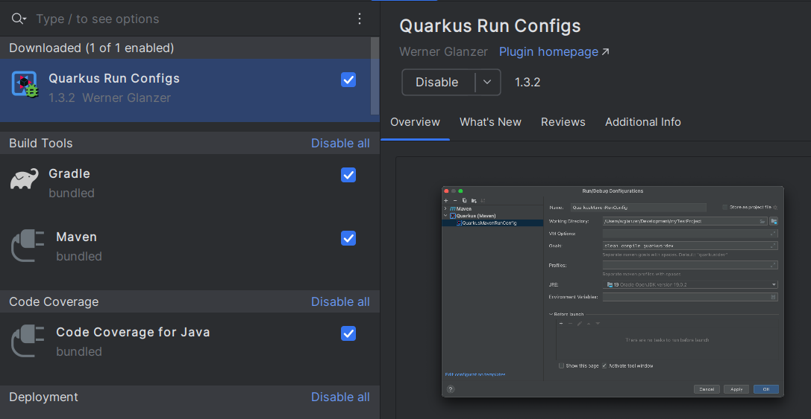
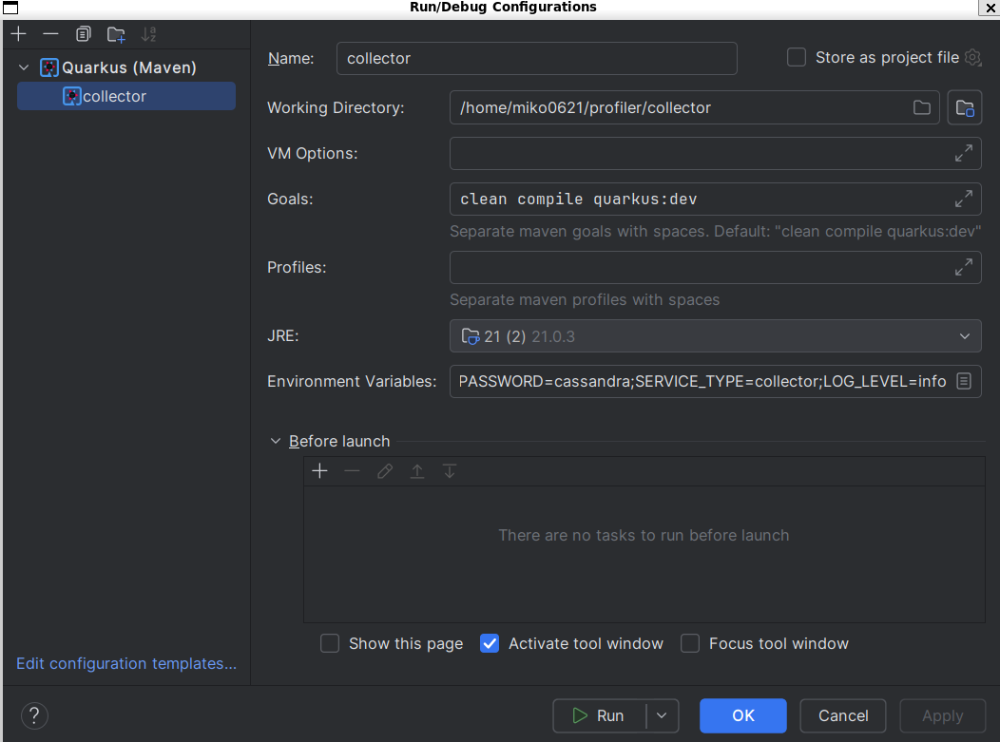
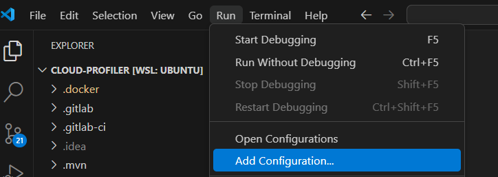
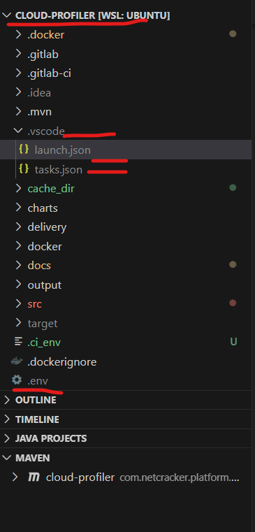
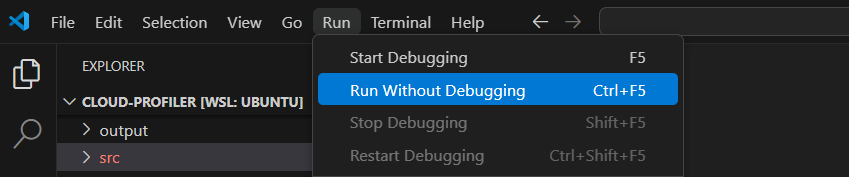

# How to set up and launch Cloud Profiler on Local system

## Table of Content

- [Introduction](#introduction)  
- [Prerequisites](#prerequisites)
- [Evironment setup](#environment-setup)  
  - [WSL 2 setup](#wsl-2-setup)
  - [Cloud Profiler Repository](#cloud-profiler-repository)
  - [Intellij IDEA Setup](#intellij-idea-setup)
  - [VS Code Setup](#vs-code-setup)

## Introduction

This guide will help user to set up the environment on their machine.
It will provide step-by-step instructions to run the Cloud Profiler locally.

## Prerequisites

- JDK 21
- IntelliJ IDEA 2023.3.5
- Wsl 2
- VS Code
- [Postgres and Minio Local Setup](/docs/cloud-maintance-job-local-setup.md#postgres-and-minio-local-setup)

## Environment setup

### WSL 2 setup

1. Install Ubuntu on wsl using `wsl --install` command.
2. Set up Docker's `apt` repository:

   ```shell
   # Add Docker's official GPG key:
   sudo apt-get update
   sudo apt-get install ca-certificates curl
   sudo install -m 0755 -d /etc/apt/keyrings
   sudo curl -fsSL https://download.docker.com/linux/ubuntu/gpg -o /etc/apt/keyrings/docker.asc
   sudo chmod a+r /etc/apt/keyrings/docker.asc

   # Add the repository to Apt sources:
   echo \
     "deb [arch=$(dpkg --print-architecture) signed-by=/etc/apt/keyrings/docker.asc] https://download.docker.com/linux/ubuntu \
     $(. /etc/os-release && echo "$VERSION_CODENAME") stable" | \
     sudo tee /etc/apt/sources.list.d/docker.list > /dev/null
   sudo apt-get update
   ```

3. Install latest Docker packages:

   ```shell
   sudo apt-get install docker-ce docker-ce-cli containerd.io \ 
     docker-buildx-plugin docker-compose-plugin
   ```

**Note:** for more info, check documentation: [Istall Docker Engine on Ubuntu](https://docs.docker.com/engine/install/ubuntu/#install-using-the-repository)

If you want to manage Docker as non-root user, check this doc: [Manage Docker as non-root user](https://docs.docker.com/engine/install/linux-postinstall/#manage-docker-as-a-non-root-user)

### Cloud Profiler Repository

Clone `cloud-profiler` repository with this git link to any location under WSL:
[PROD.Platform.CLoud.Infra.profiler.cloud-profiler](https://github.com/Netcracker/qubership-profiler-backend.git)

### Intellij IDEA Setup

- Open IntelliJ and select the ESC folder as project.
- Go to Run -> Edit Configuration
- Click '+' sign
- Select 'Quarkus (Maven)'  
**Note:** If you don't have quarkus app in selector, try install `Quarkus run configs` plugin:
    

- Update following fields:

    

  - **Name** : Any name
  - **Working Directory**: path to project folder
  - **Goals**: `clean compile quarkus:dev`
  - **JRE**: path to Java 21 JDK
  - **Environment Variables**:
  
    ```shell
    POD_NAME=collector_pod;NC_DIAGNOSTIC_MODE=dev;REMOTE_DUMP_HOST=localhost;FORCE_LOCAL_DUMP=true;SERVICE_TYPE=collector;LOG_LEVEL=info
    ```

  | Name                | Value         |
  |---------------------|---------------|
  | POD_NAME            | collector_pod |
  | NC_DIAGNOSTIC_MODE  | dev           |
  | REMOTE_DUMP_HOST    | localhost     |
  | FORCE_LOCAL_DUMP    | true          |
  | LOG_LEVEL           | info          |
  | SERVICE_TYPE        | collector     |

- **Note:** SERVICE_TYPE variable is responsible for what service would be launched, possible values are:
  - collector - To run only backend then use this type.
  - ui - To view the data on Profiler UI then use this type.

- Run the application
- IntelliJ Console will show the logs of collector service

### VS Code Setup

- Open VS Code and select the Cloud-Profiler folder from File Menu and Open Folder option.
- Go to Run -> Add Configuration, It will Open launch.json file.

  

- Add `tasks.json`  file in same folder as `launch.json` (`/.vscode`) and `.env` file in parent folder.

    

- Add below configuration in `launch.json`.

  ```json
  {
    "version": "0.2.0",
    "configurations": [
      {
        "type": "java",
        "request": "launch",
        "name": "Launch Quarkus App",
        "mainClass": "io.quarkus.bootstrap.runner.QuarkusEntryPoint",
        "cwd": "${workspaceFolder}",
        "console": "integratedTerminal",
        "preLaunchTask": "Start Quarkus Dev Mode",
        "args": [],
        "envFile": "${workspaceFolder}/.env"
      }
    ]
  }
  ```

- Add below configuration in `tasks.json` file which is present in `/.vscode` folder.

  ```json
  {
      "version": "2.0.0",
      "tasks": [
        {
          "label": "Start Quarkus Dev Mode",
          "type": "shell",
          "command": "mvn",
          "args": [
            "clean",
            "compile",
            "quarkus:dev"
          ],
          "group": "build"
        }
      ]
  }
  ```

- Add below configuration in `.env` file which is present in parent folder.

  ```text
  QUARKUS_PROFILE=cloud
  PERSISTENCE=cloud
  service.type=ui
  
  quarkus.datasource.username=postgres
  quarkus.datasource.password=postgres
  quarkus.datasource.jdbc.url=jdbc:postgresql://localhost:5432/cdt_test
  
  quarkus.minio.url=http://localhost:9000
  quarkus.minio.secret-key=minioadmin
  quarkus.minio.access-key=minioadmin
  s3.bucket-name=profiler
  s3.download.cache.dir=cache_dir
  
  NC_DIAGNOSTIC_MODE=dev
  POD_NAME=collector_pod
  REMOTE_DUMP_HOST=localhost
  FORCE_LOCAL_DUMP=true
  LOG_LEVEL=INFO
  ```

  | Name                        | Value                                      |
  |-----------------------------|--------------------------------------------|
  | POD_NAME                    | collector_pod                              |
  | NC_DIAGNOSTIC_MODE          | dev                                        |
  | REMOTE_DUMP_HOST            | localhost                                  |
  | FORCE_LOCAL_DUMP            | true                                       |
  | LOG_LEVEL                   | info                                       |
  | service.type                | collector Or ui                            |
  | PERSISTENCE                 | cloud                                      |
  | QUARKUS_PROFILE             | cloud                                      |
  | quarkus.datasource.username | postgres                                   |
  | quarkus.datasource.password | postgres                                   |
  | quarkus.datasource.jdbc.url | jdbc:postgresql://localhost:5432/cdt_test  |
  | quarkus.minio.url           | "http://localhost:9000"                    |
  | quarkus.minio.secret-key    | minioadmin                                 |
  | quarkus.minio.access-key    | minioadmin                                 |
  | s3.bucket-name              | profiler                                   |
  | s3.download.cache.dir       | cache_dir                                  |

- **Note:** `service.type` variable is responsible for what service would be launched, possible values are:
  - collector - To run only backend then use this type.
  - ui - To view the data on Profiler UI then use this type.
- Run using `Run` Menu and `Run Without Debugging` Option.
 
