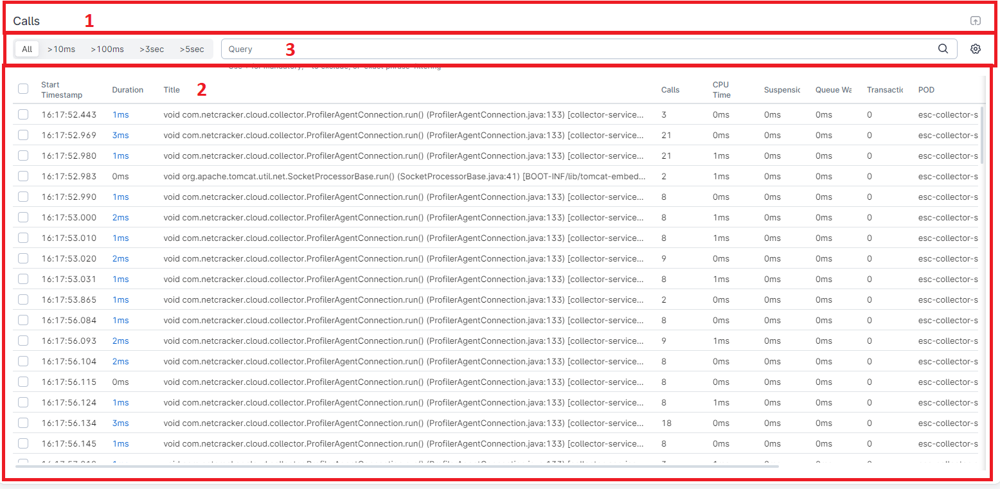
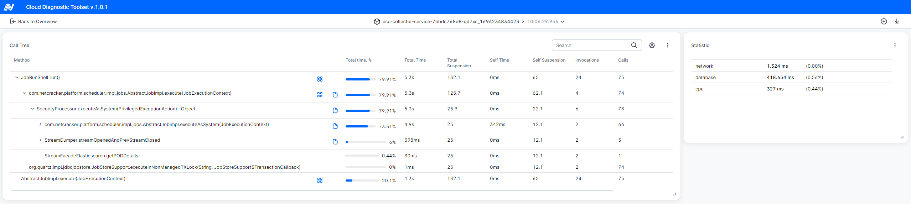
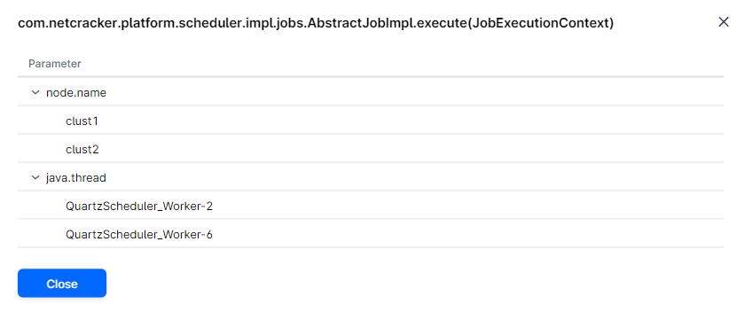
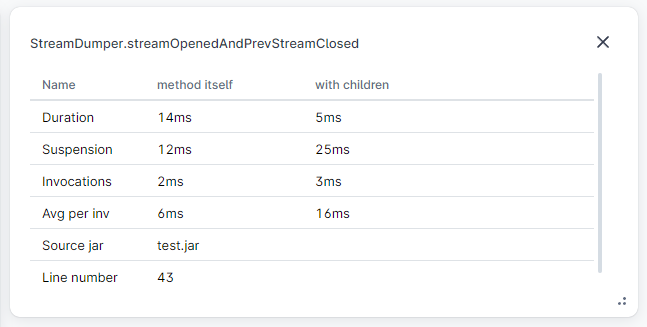
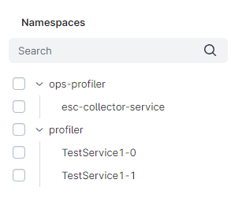

# Table of Content

* [Prerequisites](#prerequisites)
    * [IDE](#ide)
    * [Additional utils and useful links](#additional-utils-and-useful-links)
* [Project structure](#project-structure)
    * [Assets](#assets)
    * [Common](#common)
    * [Components](#components)
    * [Constants](#constants)
    * [Hooks](#hooks)
    * [Models](#models)
    * [Pages](#pages)
    * [Store](#store)
    * [Features](#features)
        * [Calls](#calls)
        * [Calls-tree](#calls-tree)
            * [Static page](#static-page)
        * [Controls](#controls)
        * [Heap-dumps](#heap-dumps)
        * [Hooks](#hooks)
        * [Pods-info](#pods-info)
        * [Sidebar](#sidebar)
* [How to](#how-to)
    * [Add REST api](#add-rest-api)

## Prerequisites

### IDE

For development purposes you can use `Visual Studio Code`.

There are several useful extensions which can be installed too:

* Prettier - Code formatter
* CSS Modules
* CSS Peek
* ESLint
* Pretty TypeScript Errors
* Sass Formatter
* Stylelint
* WSL

### Additional utils and useful links

For build and running project you need to install [Node.js and npm](https://docs.npmjs.com/downloading-and-installing-node-js-and-npm)

* [API](../../docs/internal/apis.md)
* [Typescript docs](https://www.typescriptlang.org/docs/)
* [Redux](https://redux.js.org/)
* [API mocking](https://mswjs.io/)

## Project structure

`Note`: don't forget to update component-librarie's versions to the latest in the [package.json](../../package.json)

The main code is located in the directory [src](../../src).
There are some sub-directories.

### [Assets](../../src/assets)

This directory contains all necessary resources:

* [fonts](../../src/assets/fonts)
* [icons](../../src/assets/icons)
* [illustrations](../../src/assets/illustrations)
* [styles](../../src/assets/styles)

### [Common](../../src/common)

This directory contains a description of errors, utility types, user locale.

### [Components](../../src/components)

This directory contains components that can be reused in various places.
There are next components:

* [app-header](../../src/components/app-header) - the header for application
* [highlight-cell](../../src/components/highlight-cell) - the cell with supported highlighting text
* [html-ellipsis](../../src/components/html-ellipsis) - the component for shortening text in the form of `...`
* [simple-select](../../src/components/simple-select) (no-usage).
* [table-components](../../src/components/table-componentts) - contains the `ResizableTitle` for grid-columns
* [app](../../src/components/app.tsx) includes [profiler.page](../../src/pages/profiler.page.tsx), which contains data about [Calls](#calls), [Calls-tree](#calls-tree), [Pods Info](#pods-info), [Heap Dumps](#heap-dumps), [Controls card](#controls) and [Sidebar](#sidebar)
* [confirm](../../src/components/confirm.tsx) - the component which responsible for confirming actions
* [page-layout](../../src/components/page-layout.tsx) - the component containing the title and content of the page via `<Outlet />`

### [Constants](../../src/constants)

This directory contains constants [app.constants](../../src/constants/app.constants.ts) andparameters for URL [query-params](../../src/constants/query-params.ts)

### [Hooks](../../src/hooks)

* [navigateWithQuery](../../src/hooks/use-navigate-with-query.ts) - hook for navigating by current query

### [Models](../../src/models)

This directory contains models which used in the application:

* [be-errors](../../src/models/be-errors.ts)
* [calls](../../src/models/calls.ts)
* [containers](../../src/models/containers.ts)
* [pods](../../src/models/pods.ts)

### [Pages](../../src/pages)

This directory contains the main application's pages:

* [loading-page](../../src/pages/loading.page.tsx)
* [profiler-page](../../src/pages/profiler.page.tsx)
* [static-profiler-page](../../src/pages/static-profiler.page.tsx)

### [Store](../../src/store)

This directory describes application store:

* [endpoints](../../src/store/endpoints) - used for `esc`
* [slices](../../src/store/slices) - used for the application context (see [Redux](https://redux.js.org/))
* [cdt-openapi](../../src/store/cdt-openapi.ts) - contains a description of REST API for the backend requests

### [Features](../../src/features)

This is the main directory for development tasks. 

#### [Calls](../../src/features/cdt/calls)

This feature describe view for the all calls:



##### Calls

| Query                         | REST API call             | Description                                                                             |
|-------------------------------|---------------------------|-----------------------------------------------------------------------------------------|
| getCallsStatisticsByCondition | `POST` /cdt/v2/calls/stat | Retrieve all statistics for call found by parameters                                    |
| getCallsByConditionQuery      | `POST` /cdt/v2/calls/load | Retrieve all found catched function calls for selected services in specified time range |

##### Components

[Calls.container](../../src/features/cdt/calls/calls.container.tsx) includes:

* (`1`) [ContentCard with CallsControls](../../src/features/cdt/calls/calls-controls.tsx), 
* (`2`), (`3`) - [CallsTable](../../src/features/cdt/calls/calls-table.tsx)

During choosing call `CallsControl` creates a link for view this call.

[CallsTable](../../src/features/cdt/calls/calls-table.tsx) component consist of two next elements:

* [ContentControls](../../src/features/cdt/calls/content-controls.tsx)(`3` on the picture) - this component is related to `Duration` and `Query` parameters 
* [CallsTable](../../src/features/cdt/calls/calls-table.tsx) - the main table for calls. Some useful facts:
  * Setting any parameters before rendering by the browser occurs in `useLayoutEffect`
  * Data is coming from `useGetCallsByConditionQuery`
  * The request's parameters are saved in `callRequest`, which get data from [useCallFetchArgs](../../src/features/cdt/calls/use-calls-fetch-arg.ts)
  * `handleResize` and `handleResizeStop` are responsible for changing table's size
  * `resizableColumns` is responsible for changing columns size
  * `handleTableChange` is responsible for pagination, filtration and sorting data
  * The variable `notReady` is responsible for cases of there are no any data or query's parameters there is a message `No Data` in the table. This variable get value from the [useCallFetchArgs](../../src/features/cdt/calls/use-calls-fetch-arg.ts).

[useCallsColumns](../../src/features/cdt/calls/hooks/use-calls-columns.tsx) hook is used for describing columns in the table.

##### Use-call-fetch-args hook

This hook is need to:

* getting state of the table (`page`,`sort`,`order`)
* getting data for searching calls from URL `urlParams.get(...)`
* creating query `CallsLoadRequest` with concrete parameters (`duration`,`timeTo`,`timeFrom`,`...`)

#### [Calls-Tree](../../src/features/cdt/calls-tree)

This feature describe view for the concrete calls:



##### Calls

| Query                 | REST API call                      | Description                                                | Mock                                                 |
|-----------------------|------------------------------------|------------------------------------------------------------|------------------------------------------------------|
| getCallsTreeData      | `POST` /cdt/v2/calls/tree          | Retrieve all information about call tree for selected pods | [CallsTreeInfo](../../mock-server/data/callstree.ts) |
| downloadCallsTreeData | `POST` /cdt/v2/calls/tree/download | Retrieve static calls-tree page                            |                                                      |

##### Components

[dashboard-entity](../../src/features/cdt/calls-tree/dashboard-entity) - components which describe main widgets on the page:

* [CallsTreeDashboardEntity](../../src/features/cdt/calls-tree/dashboard-entity/calls-tree-dashboard-entity.tsx) - main entity, which describes all widgets
* [CallsTreeEntity](../../src/features/cdt/calls-tree/dashboard-entity/calls-tree-dashboard-entity-calls-tree.tsx) - contentCard for main table
* [DefaultEntityActions](../../src/features/cdt/calls-tree/dashboard-entity/calls-tree-dashboard-entity-default-actions.tsx) - dropdown menu for the main actions with widgets - edit or remove
* [FrameGraphEntity](../../src/features/cdt/calls-tree/dashboard-entity/calls-tree-dashboard-entity-frame-graph.tsx) - widget for Frame Graph
* [StatsEntity](../../src/features/cdt/calls-tree/dashboard-entity/calls-tree-dashboard-entity-stats.tsx) - content card for table with stats data

[call-tree-entity](../../src/features/cdt/calls-tree/call-tree-entity) - components which describe content of widgets on the page:

* [call-tree-table](../../src/features/cdt/calls-tree/call-tree-entity/calls-tree-table) - the main table of the page, which contains call-tree. Also contains:
    * [trace-button](../../src/features/cdt/calls-tree/call-tree-entity/calls-tree-table/trace-button) - the button for show popup with stacktrace of the call
    * [params-button](../../src/features/cdt/calls-tree/call-tree-entity/calls-tree-table/params-button) - the button for show popup with parameters of the call



* [call-stats-table](../../src/features/cdt/calls-tree/call-tree-entity/calls-stats-table) - the table for call-statistics data



* [common-stats-table](../../src/features/cdt/calls-tree/call-tree-entity/common-stats-table) - the table for common statistics data

##### Static page

User is able to download calls-tree page as static html page, that can be open offline (it means, that this page calls no requests to backend).
It is implemented by following steps:

* calls tree html page is built twice:
    * as part of common frontend SPA, as it's already been implemented
    * as separate static html page with inline js/css/assets
* static calls tree html page uses separate store, that does not contain base API and open API slices to restrict requests to backend
* static calls tree html page contains special placeholders for json data and initial widget state
* static calls tree html page is delivered as separate artifact

It works by the next algorithm:

* when user click on `download` button, frontend should call special POST request to backend with information about desired calls and current widgets state
* backend takes static calls tree html page from artifact and places here current widget state (from request body) and desired calls data
* backend returns result html as response
* frontend downloads the result html file

To use it locally you should do next steps:

1. Run npm i to update dependencies;
1. Run npm run build to rebuild main SPA and static page;
1. Open ./build-static/index.html in text editor:
3.1. Find -- Placeholder for static version -- string and replace it with some CDT version, e.g. 1.0.1. This version is used in main app header;
3.2. Find -- Placeholder for json calls-tree data -- string and replace it with compressed json data for calls-tree, e.g.:

```
{"info":[{"id":"network","values":[1.324],"type":"Date","isList":false,"isIndex":false},{"id":"database","values":[418.654],"type":"Date","isList":false,"isIndex":false},{"id":"cpu","values":[327],"type":"Date","isList":false,"isIndex":false}],"children":[{"id":"0","info":{"title":"JobRunShell.run()","hasStackTrace":false,"sourceJar":"test.jar","lineNumber":123,"calls":75},"time":{"self":0,"total":5343},"timePercent":79.91,"duration":{"self":90,"total":120},"suspension":{"self":65,"total":132.1},"invocations":{"self":24,"total":26},"avg":{"self":2.2,"total":4.7},"params":[{"id":"common.started","values":["Sat Mar 09 2024 13:40:50.013 GMT+0300 (Moscow Standard Time) (1709980850013)"],"type":"String","isList":false,"isIndex":false}],"children":[{"id":"1","info":{"title":"com.netcracker.platform.scheduler.impl.jobs.AbstractJobImpl.execute(JobExecutionContext)","hasStackTrace":true,"sourceJar":"test.jar","lineNumber":3,"calls":74},"time":{"self":0,"total":5343},"timePercent":79.91,"duration":{"self":65.5,"total":94.8},"suspension":{"self":62.1,"total":125.7},"invocations":{"self":4,"total":12},"avg":{"self":4.7,"total":12.9},"params":[{"id":"node.name","type":"String","isList":false,"isIndex":false,"values":["clust1","clust2"]},{"id":"java.thread","type":"String","isList":false,"isIndex":false,"values":["QuartzScheduler_Worker-2","QuartzScheduler_Worker-6"]}],"children":[{"id":"2","info":{"title":"SecurityProcessor.executeAsSystem(PrivilegedExceptionAction) : Object","hasStackTrace":true,"sourceJar":"test.jar","lineNumber":39,"calls":73},"time":{"self":0,"total":5343},"timePercent":79.91,"duration":{"self":5.5,"total":14.8},"suspension":{"self":22.1,"total":25.9},"invocations":{"self":6,"total":11},"avg":{"self":45.7,"total":125.9},"children":[{"id":"3","info":{"title":"com.netcracker.platform.scheduler.impl.jobs.AbstractJobImpl.executeAsSystem(JobExecutionContext)","hasStackTrace":true,"sourceJar":"test.jar","lineNumber":43,"calls":66},"time":{"self":342,"total":4915},"timePercent":73.51,"duration":{"self":15.5,"total":34.7},"suspension":{"self":12.1,"total":25},"invocations":{"self":2,"total":3},"avg":{"self":5.7,"total":15.9},"children":[{"id":"4","info":{"title":"SchedulerLockManager.blockJob(BigInteger) : boolean","hasStackTrace":true,"sourceJar":"test.jar","lineNumber":43,"calls":33},"time":{"self":2,"total":4573},"timePercent":68.4,"duration":{"self":16.6,"total":34.8},"suspension":{"self":12.1,"total":25},"invocations":{"self":2,"total":3},"avg":{"self":5.7,"total":15.9}},{"id":"5","info":{"title":"SecurityProcessor.doAs(PrivilegedExceptionAction, String) : Object","hasStackTrace":true,"sourceJar":"test.jar","lineNumber":43,"calls":33},"time":{"self":2,"total":342},"timePercent":5.1,"duration":{"self":16.6,"total":34.8},"suspension":{"self":12.1,"total":25},"invocations":{"self":2,"total":3},"avg":{"self":5.7,"total":15.9}}]},{"id":"6","info":{"title":"StreamDumper.streamOpenedAndPrevStreamClosed","hasStackTrace":true,"sourceJar":"test.jar","lineNumber":43,"calls":3},"time":{"self":0,"total":398},"timePercent":6,"duration":{"self":14.2,"total":4.7},"suspension":{"self":12.1,"total":25},"invocations":{"self":2,"total":3},"avg":{"self":5.7,"total":15.9},"children":[{"id":"7","info":{"title":"ElasticSearchQueryUtils.searchAndConvert","hasStackTrace":false,"sourceJar":"test.jar","lineNumber":43,"calls":1},"time":{"self":398,"total":398},"timePercent":6,"duration":{"self":5.5,"total":14.7},"suspension":{"self":12.1,"total":25},"invocations":{"self":2,"total":3},"avg":{"self":5.7,"total":15.9}}]},{"id":"8","info":{"title":"StreamFacadeElasticsearch.getPODDetails","hasStackTrace":false,"sourceJar":"test.jar","lineNumber":43,"calls":1},"time":{"self":0,"total":30},"timePercent":0.44,"duration":{"self":62.5,"total":21.2},"suspension":{"self":12.1,"total":25},"invocations":{"self":2,"total":3},"avg":{"self":5.7,"total":15.9}}]}]},{"id":"9","info":{"title":"org.quartz.impl.jdbcjobstore.JobStoreSupport.executeInNonManagedTXLock(String, JobStoreSupport$TransactionCallback)","hasStackTrace":false,"sourceJar":"test.jar","lineNumber":43,"calls":74},"time":{"self":0,"total":0.1},"timePercent":0,"duration":{"self":1.5,"total":4.7},"suspension":{"self":12.1,"total":25},"invocations":{"self":2,"total":3},"avg":{"self":5.7,"total":15.9}}]},{"id":"10","info":{"title":"AbstractJobImpl.execute(JobExecutionContext)","hasStackTrace":false,"sourceJar":"test.jar","lineNumber":123,"calls":75},"time":{"self":0,"total":1343},"timePercent":20.1,"duration":{"self":90,"total":120},"suspension":{"self":65,"total":132.1},"invocations":{"self":24,"total":26},"avg":{"self":2.2,"total":4.7},"params":[{"id":"common.started","values":["Sat Mar 09 2024 13:40:50.013 GMT+0300 (Moscow Standard Time) (1709980850013)"],"type":"String","isList":false,"isIndex":false}]}]}
```

3.3. Find `-- Placeholder for initial layout --` string and replace it with compressed json data for initial panels layout, e.g.:

```
[{"i":"frame-graph","x":0,"y":0,"w":12,"h":1},{"i":"calls-tree","x":0,"y":0,"w":9,"h":2},{"i":"stats","x":9,"y":0,"w":3,"h":2}]
```

4. Open `./build-static/index.html` in browser;

To use it on backend you should do next steps:

1. When user clicks download button, frontend sends POST request to /cdt/v2/calls/tree/download endpoint with initial panel layout in body. Example of the JSON body:

```json
{
	"initialPanelState": [
		{
			"w": 9,
			"h": 2,
			"x": 0,
			"y": 1,
			"i": "calls-tree",
			"moved": false,
			"static": false
		},
		{
			"w": 3,
			"h": 2,
			"x": 9,
			"y": 1,
			"i": "stats",
			"moved": false,
			"static": false
		}
	]
}
```

1. Backend should take static page template from /build-static/index.html file in .tgz artifact;
1. Backend should take received initialPanelState JSON and fill it instead of -- Placeholder for initial layout -- from template;
1. Backend should take the version (result of /esc/version endpoint) and fill it instead of -- Placeholder for static version -- from template;
1. Backend should take calls tree JSON data (result of /cdt/v2/calls/tree endpoint) and fill it instead of -- Placeholder for json calls-tree data -- from template;
1. Backend returns the result static html page as-is in response;

**Note**: you can take the mock for download request to check, how it should work;

**Note**: it's not all placeholders, in future they can be more (e.g. desired calls info);

#### [Controls](../../src/features/cdt/controls)


This component describes next elements:

* IsoDatePicker - time picker field passing value to URL (`dateTo`, `dateFrom`)
* handleChangeFastRange - (`2`) changing time on `Last 15 min`, `Last 1h`, `Last 2h`, `Last 4h`
* handleChangePicker - (`1`) changing time via choosing parameters `From` and `To`
* footer contains tabs for  changing page (`3`)

#### [Heap-dumps](../../src/features/cdt/heap-dumps)


##### Calls

| Query        | REST API call        | Description                                                          | Mock                                             |
|------------- |----------------------|----------------------------------------------------------------------|--------------------------------------------------|
| getHeapDumps | `POST` /cdt/v2/heaps | Retrieve list of heap dumps for microservice in specified time range | [HeapDumps](../../mock-server/data/heaps.ts) |

##### Components

[Heap-dumps.container](../../src/features/cdt/heap-dumps/heap-dumps.container.tsx) contains [heap-dumps-table](../../src/features/cdt/heap-dumps/heap-dumps-table.tsx) which describes table colummns, getting data by `useGetHeapDumpsQuery` from [cdt-openapi](../../src/store/cdt-openapi.ts) with concrete service parameters

##### trow-actions

[trow-actions](../../src/features/cdt/heap-dumps/trow-actions.tsx) describes buttons, which is needed for downloading and deleting dump.
There is a `handleDeleteDump` for deleting and `getDownloadDumpUrl` queries for downloading from [cdt-openapi](../../src/store/cdt-openapi.ts)

#### [Hooks](../../src/features/cdt/hooks)

##### [Use-sidebar-api-args](../../src/features/cdt/hooks/use-sidebar-api-args.ts)

This hook allows you to receive selected services/namespaces from [namespaces-tree](../../src/features/cdt/sidebar/namespaces-tree.tsx).
URL getting services from parameter `services` in [query-params](../../src/constants/query-params.ts) and check for getting such services on the backend.
The data for backend is getting from [useNamespacesTreeData](../../src/features/cdt/sidebar/use-namespaces-tree-data.ts).
See also [Sidebar](#sidebar)

#### [Pods info](../../src/features/cdt/pods-info)


##### Calls

| Query                | REST API call            | Description                                                       | Mock                                               |
|----------------------|--------------------------|-------------------------------------------------------------------|----------------------------------------------------|
| getServices          | `POST` /cdt/v2/services  | Retrieve all active services in specified time range in one fetch | [Services](../../mock-server/data/services.ts)     |
| getNamespacesByRange | `POST` cdt/v2/containers | Retrieve all active services in specified time range in one fetch | [Containers](../../mock-server/data/containers.ts) |

##### Components 

[Pods-info](../../src/features/cdt/pods-info/pods-info.tsx) consist of:
* [pods-table](../../src/features/cdt/pods-info/pods-table.tsx) (`1`)
* `ContentCard`, which include the title and the search field (`2`)

Search field with the value from URL.

[Pods-table](../../src/features/cdt/pods-info/pods-table.tsx) with data about services from `useGetServicesQuery` and about namespaces from `useGetNamespacesByRangeQuery` ([cdt-openapi](../../src/store/cdt-openapi.ts)) with necessary parameters. After that services and namespaces getting into `createPodsInfoTableDataSource` from [tree-utils](../../src/features/cdt/pods-info/utils/tree-utils.tsx) and as a result it creates `dataSource` for the table.

[columns](../../src/features/cdt/pods-info/columns.tsx) contains description of table colums. 
Also there is a button for downloading data about service - [dumps-download-opts](../../src/features/cdt/pods-info/dumps-download-opts.tsx).

#### [Sidebar](../../src/features/cdt/sidebar)



##### Calls

| Query         | REST API call           | Description                                                                          | Mock                                           |
|---------------|-------------------------|--------------------------------------------------------------------------------------|------------------------------------------------|
| getNamespaces | `GET` cdt/v2/containers | Retrieve all services saved in database in one fetch as tree (grouped by namespaces) | [Services](../../mock-server/data/services.ts) |

##### Components

[Namespaces-tree](../../src/features/cdt/sidebar/namespaces-tree.tsx) is responsible for:

* displaying namespaces and services received from the backend
* searching by received namespaces

on the pages [namespaces-tree](../../src/features/cdt/sidebar/namespaces-tree.tsx) and [profiler.page](../../src/pages/profiler.page.tsx).

The data for sidebar is getting from [useNamespacesTreeData](../../src/features/cdt/sidebar/use-namespaces-tree-data.ts), which uses query `useGetNamespacesQuery` from [cdt-openapi](../../src/store/cdt-openapi.ts).

When you select a tree element, data on the service/namespace is added to the URL, from it will be used for comparison with real data on the backend and search request.

The hook [use-checked-keys](../../src/features/cdt/sidebar/use-checked-keys.tsx) is needed for getting data from URL.

## How to

### Add REST api

#### Describing call in [cdt-openapi.ts](../../src/store/cdt-openapi.ts)

The main file which contains all api-calls: [cdt-openapi.ts](../../src/store/cdt-openapi.ts)

Const `cdtOpenapi` contains all `endpoints` which can be use in application.

The structure of endpoint:

*name*: build.*query*<*nameResp*, *nameArg*>({
&emsp;query: queryArg => ({
&emsp;url: `/cdt/v2/some-endpoint`,
&emsp;method: 'POST',
&emsp;params: {},
&emsp;body: {}
&ensp;}),
}),

Where:

* name - the name of your method
* query - is the the request type: [query](https://redux-toolkit.js.org/rtk-query/usage/queries) or [mutation](https://redux-toolkit.js.org/rtk-query/usage/mutations)
* nameResp - the structure for describing response
* nameArg - the structure for describing arguments
* queryArg - the arguments for query, where `url` is the REST call for your query

The next step is to add hook for your query in the const `cdtOpenapi` like `use*name*Query`.

#### Describing model

The fundamental structrure of redux applications described [here](https://redux.js.org/tutorials/fundamentals/part-2-concepts-data-flow)

The main points:

* the `state`, the source of truth that drives our app;
* the `view`, a declarative description of the UI based on the current state
* the `actions`, the events that occur in the app based on user input, and trigger updates in the state

The `store` is the main source of your feature. For [example](../../src/features/cdt/calls/calls-store.tsx). 

There is a model for your feature, some constants and components description.

After that this model can be used in the [application code](../../src/features/cdt/calls/calls.container.tsx)


