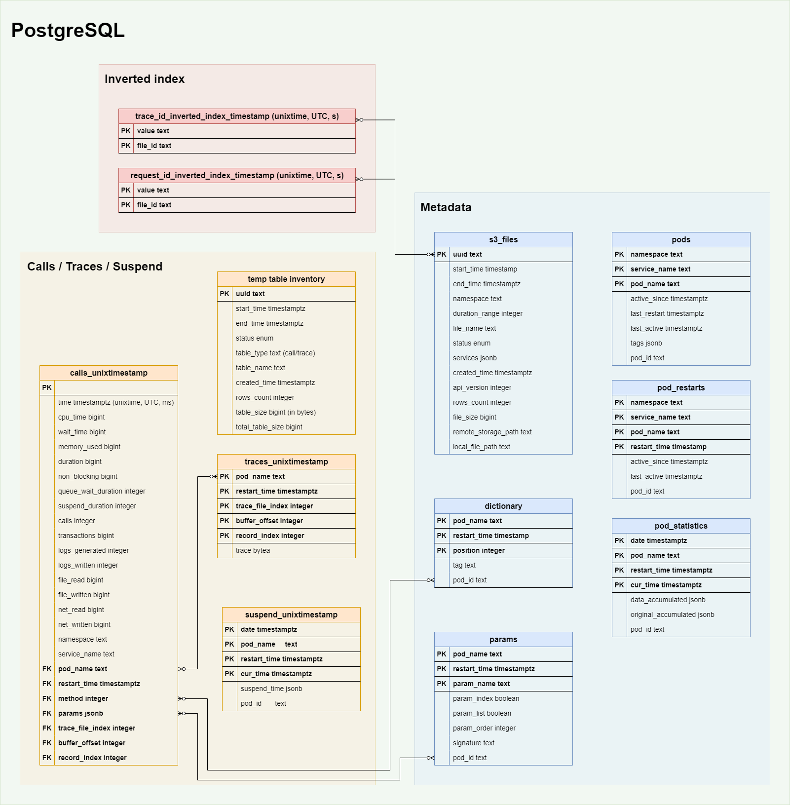
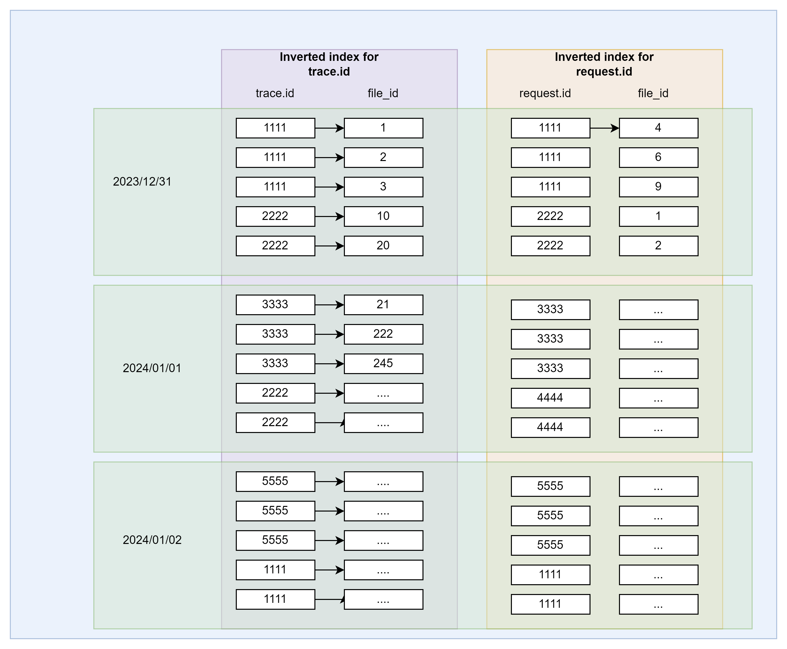
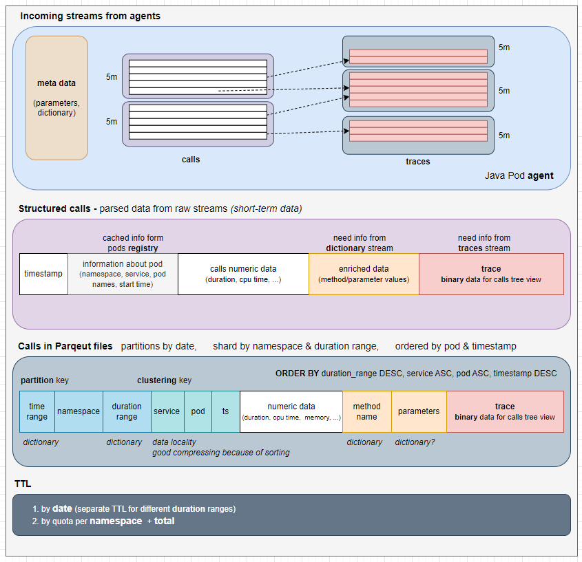

This document will explain the database structure.

<!-- TOC -->
* [Introduction](#introduction)
* [PostgreSQL Schema](#postgresql-schema)
  * [Temporary Tables](#temporary-tables)
    * [Calls temp table](#calls-temp-table)
    * [Trace Temp Table](#trace-temp-table)
    * [Temporary Inventory Table](#temporary-inventory-table)
  * [Inverted Index Tables](#inverted-index-tables)
  * [Metadata](#metadata)
    * [S3 Files Table](#s3-files-table)
    * [Pods](#pods)
    * [Pods Restart](#pods-restart)
    * [Dictionary](#dictionary)
    * [Params](#params)
* [S3 Storage](#s3-storage)
  * [File Folder structure in S3 storage](#file-folder-structure-in-s3-storage)
  * [Apache Parquet Files Schema](#apache-parquet-files-schema)
    * [Schema](#schema)
      * [Calls](#calls)
* [Appendix](#appendix)
  * [Appendix A. Duration ranges](#appendix-a-duration-ranges)
<!-- TOC -->

# Introduction

As outlined in the [High-Level architecture](profiler-high-level-architecture.md) once performance data is received
from multiple agents, the Profiler services begin processing and storing it in either a `persistent volume` (PV) or a
`PostgreSQL` database. Later these row data will be stored in S3 for longer period in a `Parquet` file format.

* Collector: Parses binary performance data and temporarily stores it in PostgreSQL.
* Dumps Collector: Performs several tasks:
  * Stores collected dumps in an attached persistent volume.
  * Saves metadata related to the dumps in PostgreSQL.
  * Compresses top and thread dumps into ZIP archives every hour to optimize storage.
  * Cleans up data older than two weeks.
* Compactor: Every hour, it retrieves performance data from PostgreSQL, enriches it, and generates Parquet files. These
  files are temporarily saved in a persistent volume and later uploaded to S3-compatible storage.

# PostgreSQL Schema

This section outlines the schema of the `PostgreSQL` tables that will serve different purposes. It includes detailed
descriptions and parameters for each table, along with a diagram illustrating the overall schema.

There are both temporary and permanent tables. Temporary tables are created dynamically, with a timestamp appended to
their names.  

> **Note:**
> `Calls`, `Traces` and `Suspend` Tables get created using timestamp `granularity` but `dump_objects` created
> using `partitioning`

**TODO:** Decision on including dumps_objects table in the figure will be decided later

**Partitioning**

We are using PostgreSQL `partitioning` feature for handling large datasets, as it allows for more efficient data
storage, retrieval and maintenance. PostgreSQL supports several partitioning methods including range, list, and hash
partitioning.  
We are using partitioning for `dump_objects` table using `range` method.



## Temporary Tables

These tables are created dynamically by maintainer three hours in advance, with a `_unixtimestamp` suffix representing the
Unix timestamp in seconds.

* These table will be created by `maintainer` job using `partitioning` feature of PostgerSQL.
* Old tables will be `dropped` by `maintainer` job.

### Calls temp table

The collector stores each `call` received from the `agent` in `PostgreSQL` tables for 5 minutes. The `compactor` then
processes this data. Each table entry includes a reference to the Trace table, which is used to aggregate all call data
before saving it to a `.parquet` file.

| Field name          | Type        | Description                                                             |
|---------------------|-------------|-------------------------------------------------------------------------|
| time                | timestamptz | timestamp (Unix time, UTC, ms)                                          |
| cpu_time            | bigint      | actual time for work (in ms)                                            |
| wait_time           | bigint      | common wait (in ms)                                                     |
| memory_used         | integer     | memory used by method (in bytes)                                        |
| duration            | integer     | duration of method (in ms)                                              |
| non_blocking        | bigint      | Actual execution duration of method (in ms)                             |
| queue_wait_duration | integer     | wait in queue (in ms)                                                   |
| suspend_duration    | integer     | specifies the server hang-up duration (time spend for GC, for example). |
| calls               | integer     | count of internal calls                                                 |
| transactions        | bigint      | count of DB transactions                                                |
| logs_generated      | integer     | bytes generated by method                                               |
| logs_written        | integer     | bytes written by method                                                 |
| file_read           | bigint      | disk bytes read by method                                               |
| file_written        | bigint      | disk bytes written by method                                            |
| net_read            | bigint      | I/O read by method (in bytes)                                           |
| net_written         | bigint      | I/O write by method (in bytes)                                          |
| namespace           | text        | namespace name                                                          |
| service_name        | text        | service name                                                            |
| pod_name            | text        | pod name                                                                |
| restart_time        | timestamptz | restart timestamp for pod (Unix time, UTC, ms)                          |
| method              | integer     | method name from dictionary                                             |
| params              | jsonb       | multiple chunks of parameter values                                     |
| trace_file_index    | integer     | link to offset to corresponding trace file position                     |
| buffer_offset       | integer     | link to offset to corresponding trace file buffer position              |
| record_index        | integer     | link to offset to corresponding trace file record position              |

This table will be accessed by the following services with their designated permissions:

| Service   | Permission    |
|-----------|---------------|
| collector | Write         |
| compactor | Read          |
| K8S Job   | Create/Delete |

### Trace Temp Table

This table stores `traces` for `calls`.

| Name             | Type        | Description                                         |
|------------------|-------------|-----------------------------------------------------|
| pod_name         | text        | Pod name                                            |
| restart_time     | timestamptz | Pod restart time                                    |
| trace_file_index | integer     | link to offset to corresponding trace file position |
| buffer_offset    | integer     | Buffer Offset value                                 |
| record_index     | integer     | record Index value                                  |
| trace            | bytea       | Trace data                                          |

This table will be accessed by the following services with their designated permissions:

| Service   | Permission    |
|-----------|---------------|
| collector | Write         |
| compactor | Read          |
| K8S Job   | Create/Delete |

### Temporary Inventory Table

It stores the information about the temporary tables created in the database

| Name             | Type        | Description                                                           |
|------------------|-------------|-----------------------------------------------------------------------|
| uuid             | text        | Unique ID                                                             |
| start_time       | timestamptz | (start of the time range) time range for which it contains data       |
| end_time         | timestamptz | (end of the time range) time range for which it contains data         |
| status           | enum        | Status of the table                                                   |
| table_type       | text        | Type of the table                                                     |
| table_name       | text        | full table name to use                                                |
| created_time     | timestamptz | Time when table get created                                           |
| rows_count       | integer     | Number of rows of the table                                           |
| table_size       | bigint      | the on-disk size of a table                                           |
| total_table_size | bigint      | the total disk space used by a table including all associated objects |

> **Note:** status can have 5 different values:
>
> * creating
> * ready
> * persisting
> * persisted
> * to_delete

This table will be accessed by the following services with their designated permissions:

| Service    | Permission       |
|------------|------------------|
| collector  | Read             |
| ui-service | Read             |
| K8S Job    | Write/Clean/Read |

## Inverted Index Tables

These are temporary tables created dynamically and partitioned by time, with a separate table for each parameter. They
are used to store the inverted index for parameters within the `params` field of the `call` structure. The tables are
sharded by parameter name and partitioned by date. Each table contains all possible values for a specific parameter,
along with the corresponding S3 file ID where that value appears. This design represents a many-to-many relationship,
using a composite primary key of the value and file ID pair.

| Name    | Type    | Description        |
|---------|---------|--------------------|
| value   | any     | value of parameter |
| file_id | integer | file ID on S3      |

This table will be accessed by the following services with their designated permissions:

| Service    | Permission |
|------------|------------|
| compactor  | Read/Write |
| ui-service | Read       |
| K8S job    | Clean      |



**TODO:** This table will be revisited again in next revision.

## Metadata

This section describes metadata tables. These are permanent tables.

### S3 Files Table

This table holds metadata for all files stored on S3. It operates independently, with no relationships to other tables,
and contains information essential for search and debugging purposes.

| Name                | Type        | Description                                                         |
|---------------------|-------------|---------------------------------------------------------------------|
| uuid                | text        |                                                                     |
| start_time          | timestamptz | start time of the time range for which it contains data             |
| end_time            | timestamptz | end time of the time range for which it contains data               |
| file_type           | enum        | calls or traces                                                     |
| dump_type           | text        | only for dumps from java and go applications                        |
| namespace           | text        | namespace of the service                                            |
| duration_range      | integer     | (for calls) duration range for calls (in ms)                        |
| file_name           | text        | Name of the file                                                    |
| status              | enum        | Represent current status of the file in PV creating, created etc.   |
| services            | jsonb       | services that are in the file                                       |
| created_time        | integer     | File creation time                                                  |
| api_version         | text        | version of our design                                               |
| rows_count          | integer     | the number of rows per file                                         |
| file_size           | bigint      | file size                                                           |
| remote_storage_path | text        | link to s3                                                          |
| local_file_path     | text        | link to PV, where we will store temporary file before send it to S3 |

> **Note:** `status` represent the file processing status in PV, we create file first in PV and then transfer it s3 for long
> term storage, status can have 5 different values:
>
> * creating
> * created
> * transferring
> * completed
> * to_delete

This table will be accessed by the following services with their designated permissions:

| Service         | Permission |
|-----------------|------------|
| compactor       | Read/Write |
| maintenance job | Read/Clean |
| ui-service      | Read       |

### Pods

Pod table contains information about pods which have some dumps.

| Name         | Type        | Description                                     |
|--------------|-------------|-------------------------------------------------|
| namespace    | text        | Namespace                                       |
| service_name | text        | Service name                                    |
| pod_name     | text        | Pod Name                                        |
| active_since | timestamptz | start of first deployment                       |
| last_restart | timestamptz | pod's last restart                              |
| last_active  | timestamptz | Time, when last dump for this pod was generated |
| tags         | jsonb       | Tag list associated with Pods                   |
| pod_id       | text        | Internal unique identificator of the pod        |

This table will be accessed by the following services with their designated permissions:

| Service   | Permission |
|-----------|------------|
| collector | Read/Write |
| compactor | Read       |
| ui        | Read       |
| K8S Job   | Clean      |

### Pods Restart

This table stores list of all pods restarts.

| Name         | Type        | Description                                     |
|--------------|-------------|-------------------------------------------------|
| pod_name     | text        | Pod Name                                        |
| restart_time | timestamptz | Time when restart happened                      |
| namespace    | text        | namespace                                       |
| service_name | text        | Service Name                                    |
| pod_id       | text        | Unique Id of the restarted pod                  |
| active_since | timestamptz | start of first deployment                       |
| last_active  | timestamptz | time, when last dump for this pod was generated |

This table will be accessed by the following services with their designated permissions:

| Service   | Permission |
|-----------|------------|
| collector | Read/Write |
| compactor | Read       |
| ui        | Read       |
| K8S Job   | Clean      |

### Dictionary

This table store one row per pod with cached dictionary

| Name         | Type        | Description                                                               |
|--------------|-------------|---------------------------------------------------------------------------|
| pod_name     | text        | Pod Name                                                                  |
| restart_time | timestamptz | Time when restart happened                                                |
| position     | integer     | Position of the value/tag                                                 |
| pod_id       | text        | Unique Id of the pod                                                      |
| tag          | text        | Method name or string constant <br/>from pod which represent actual value |

This table will be accessed by the following services with their designated permissions:

| Service   | Permission |
|-----------|------------|
| collector | Read/Write |
| ui        | Read       |
| k8s job   | Read/Clean |

### Params

This table store the method parameter or attribute passed during execution.

| Name         | Type        | Description                                                     |
|--------------|-------------|-----------------------------------------------------------------|
| pod_name     | text        | Name of the Pod                                                 |
| restart_time | timestamptz | Time when restart happened                                      |
| param_name   | text        | Parameter Name                                                  |
| param_index  | boolean     | Whether param is indexed or not                                 |
| param_list   | boolean     | Whether param is of list type                                   |
| param_order  | integer     | Params are order by priority, this field represent the position |
| signature    | text        | Description of param                                            |
| pod_id       | text        | Internal unique identification of the pod                       |

This table will be accessed by the following services with their designated permissions:

| Service   | Permission |
|-----------|------------|
| collector | Read/Write |
| ui        | Read       |
| k8s job   | Read/Clean |

# S3 Storage

We use Simple Storage Service (S3) for long-term storage, where data is stored in the `Parquet` file format to ensure
efficient compression and query performance.

## File Folder structure in S3 storage

S3 stores data as **objects** within **buckets**. An object consists of a file along with its associated metadata, while
a bucket serves as a container for storing these objects.  
At the top level, there is a **primary bucket** used to store all data collected by the Profiler that needs to be
persisted. Within this bucket, the directory structure is organized hierarchically by **year → month → day → hour**.
The data is further **partitioned by `namespace` and `duration_range`** and within each partition, it is **sorted
by `pod` and `timestamp`** to support efficient access and querying.

More about partitioning by namespace and duration in [Appendix A](#appendix-a-duration-ranges)

> **Note:** We are not storing dumps in S3, use PV for that.


## Apache Parquet Files Schema

Apache Parquet is an open-source, columnar data file format optimized for efficient storage and fast retrieval. It
supports advanced compression and encoding techniques, making it well-suited for processing large volumes of complex
data. Parquet is designed as a versatile interchange format for both batch processing and interactive analytics
workloads.  
Unlike row-based formats like CSV, where data is stored row by row, Parquet stores data by column, which significantly
improves query performance and reduces storage costs. This makes it ideal for analytical workloads and data.  

For more information please refer [Apache Parquet Files](https://parquet.apache.org/docs/overview/).

### Schema

The incoming binary data stream from the agent includes metadata (such as `params`, `dictionary` etc.), along
with `calls` and `traces`. The `calls` data is segmented based on a configurable granularity (e.g., 5 minutes)
and `trace` data is streamed similarly, containing references to the corresponding `calls` data.

The **Collector** parses the raw binary data and temporarily stores it in a `PostgreSQL` table as row-level data. After
a short period, this data is enriched with `dictionary` information and a reference to the related `traces` is added to
facilitate further processing.

The **Compactor** is responsible for persisting the enriched row data from `PostgreSQL` into **Parquet** files. These
files are:

* **Partitioned** by date
* **Sharded** by `namespace` and `duration_range`
* **Ordered** by `pod` and `timestamp`

Since Parquet files are not suitable for raw binary data, all data is stored in a **decoded** format. Traces are saved
in a **call tree structure** using **JSON**, enabling seamless integration with the **UI service** for visualization and
supporting later use by **analytics tools**.



#### Calls

**PostgreSQL table**

| Field name          | Go Type           | Parquet Type | Description                                                             |
|---------------------|-------------------|--------------|-------------------------------------------------------------------------|
| time                | int64             | int64        | timestamp (Unix time, UTC, ms)                                          |
| cpu_time            | int64             | int64        | actual time for work (in ms)                                            |
| wait_time           | int64             | int64        | common wait (in ms)                                                     |
| memory_used         | int64             | int64        | memory used by method (in bytes)                                        |
| duration            | int32             | int32        | duration of method (in ms)                                              |
| non_blocking        | int64             | int64        | ???                                                                     |
| queue_wait_duration | int32             | int32        | wait in queue (in ms)                                                   |
| suspend_duration    | int32             | int32        | specifies the server hang-up duration (time spend for GC, for example). |
| calls               | int32             | int32        | count of internal calls                                                 |
| transactions        | int64             | int64        | count of DB transactions                                                |
| logs_generated      | int32             | int32        | bytes generated by method                                               |
| logs_written        | int32             | int32        | bytes written by method                                                 |
| file_read           | int64             | int64        | disk bytes read by method                                               |
| file_written        | int64             | int64        | disk bytes written by method                                            |
| net_read            | int64             | int64        | I/O read by method (in bytes)                                           |
| net_written         | int64             | int64        | I/O write by method (in bytes)                                          |
| namespace           | string            | byte_array   | namespace name                                                          |
| service_name        | string            | byte_array   | service name                                                            |
| pod_name            | string            | byte_array   | pod name                                                                |
| restart_time        | int64             | int64        | restart timestamp for pod (Unix time, UTC, ms)                          |
| method              | string            | byte_array   | method name from dictionary                                             |
| params              | map[string]string | map          | multiple chunks of parameter values                                     |
| trace_file_index    | string            | byte_array   | link to offset to corresponding trace file position                     |
| trace               | string            | byte_array   | binary data of call tree from corresponding trace file                  |
| buffer_offset       | int64             | int64        |                                                                         |
| record_index        | int64             | int64        |                                                                         |

**Parquet File:**

```go
type CallParquet struct {
  Time              int64                      `parquet:"name=time, type=INT64"`
  CpuTime           int64                      `parquet:"name=cpuTime, type=INT64"`
  WaitTime          int64                      `parquet:"name=waitTime, type=INT64"`
  MemoryUsed        int64                      `parquet:"name=memoryUsed, type=INT64"`
  Duration          int32                      `parquet:"name=duration, type=INT32"`
  NonBlocking       int64                      `parquet:"name=nonBlocking, type=INT64"`
  QueueWaitDuration int32                      `parquet:"name=queueWaitDuration, type=INT32"`
  SuspendDuration   int32                      `parquet:"name=suspendDuration, type=INT32"`
  Calls             int32                      `parquet:"name=calls, type=INT32"`
  Transactions      int64                      `parquet:"name=transactions, type=INT64, convertedtype=UINT_64"`
  LogsGenerated     int32                      `parquet:"name=logsGenerated, type=INT32"`
  LogsWritten       int32                      `parquet:"name=logsWritten, type=INT32"`
  FileRead          int64                      `parquet:"name=fileRead, type=INT64, convertedtype=UINT_64"`
  FileWritten       int64                      `parquet:"name=fileWritten, type=INT64, convertedtype=UINT_64"`
  NetRead           int64                      `parquet:"name=netRead, type=INT64, convertedtype=UINT_64"`
  NetWritten        int64                      `parquet:"name=netWritten, type=INT64, convertedtype=UINT_64"`
  Namespace         string                     `parquet:"name=namespace, type=BYTE_ARRAY, convertedtype=UTF8, encoding=PLAIN_DICTIONARY"`
  ServiceName       string                     `parquet:"name=serviceName, type=BYTE_ARRAY, convertedtype=UTF8, encoding=PLAIN_DICTIONARY"`
  PodName           string                     `parquet:"name=podName, type=BYTE_ARRAY, convertedtype=UTF8, encoding=PLAIN_DICTIONARY"`
  RestartTime       int64                      `parquet:"name=restartTime, type=INT64"`
  Method            string                     `parquet:"name=method, type=BYTE_ARRAY, convertedtype=UTF8, encoding=PLAIN_DICTIONARY"`
  Params            map[string]ParamsValueList `parquet:"name=params, type=MAP, convertedtype=MAP, keytype=BYTE_ARRAY, keyconvertedtype=UTF8" `
  Index             string                     `parquet:"name=index, type=BYTE_ARRAY, convertedtype=UTF8"`
  Trace             string                     `parquet:"name=bytearray, type=BYTE_ARRAY"`
 }

type ParamsValueList struct {
  ValueList []string `parquet:"name=valueList, type=LIST, valuetype=BYTE_ARRAY, valueconvertedtype=UTF8"`
}

```

> **Note:**
> `Index` in `CallParquet` is the combination of `trace_file_index`, `buffer_offset` and `record_index`, concatinnated
> by underscore ('_')

# Appendix

## Appendix A. Duration ranges

The following set of duration ranges has been defined that will be used for compaction:<br/>

| timerange            | short number (in ms)     | short name | file name example            |
|----------------------|--------------------------|------------|------------------------------|
| \`0\` - \`1ms\`      | 1                        | 0ms        | cloud_profiler_0ms.parquet   |
| \`1ms\` - \`10ms\`   | 10                       | 1ms        | cloud_profiler_1ms.parquet   |
| \`10ms\` - \`100ms\` | 100                      | 10ms       | cloud_profiler_10ms.parquet  |
| \`100ms\` - \`1s\`   | 1000                     | 100ms      | cloud_profiler_100ms.parquet |
| \`1s\` - \`5s\`      | 5000                     | 1s         | cloud_profiler_1s.parquet    |
| \`5s\` - \`30s\`     | 30000                    | 5s         | cloud_profiler_5s.parquet    |
| \`30s\` - \`90s\`    | 90000                    | 30s        | cloud_profiler_30s.parquet   |
| \`>90s\`             | a number more than 90000 | 90s        | cloud_profiler_90s.parquet   |

The file name and its contents will follow the formula:<br>

> file_name = namespace + duration_range(short name) from the list above

The name of each file will contain the upper boundary of the range, which includes all calls in the file.
