# Profiler High-Level Architecture

## Table of Content

<!-- TOC -->
* [Profiler High-Level Architecture](#profiler-high-level-architecture)
  * [Table of Content](#table-of-content)
  * [High-Level Architecture Diagram](#high-level-architecture-diagram)
    * [Components](#components)
      * [1. profiler-agent](#1-profiler-agent)
      * [2. nc-diagnostic-agent (on the application side)](#2-nc-diagnostic-agent-on-the-application-side)
      * [3. nc-diagnostic-agent (on the CDT server side)](#3-nc-diagnostic-agent-on-the-cdt-server-side)
      * [4. dumps-collector](#4-dumps-collector)
      * [5. collector](#5-collector)
      * [6. compactor](#6-compactor)
      * [7. maintenance-job](#7-maintenance-job)
      * [8. ui-service](#8-ui-service)
    * [Data Flow](#data-flow)
      * [profiler-agent configuration](#profiler-agent-configuration)
      * [profiler-agent and data it sends](#profiler-agent-and-data-it-sends)
      * [Dumps Collector](#dumps-collector)
      * [Collectors](#collectors)
      * [Compactor](#compactor)
      * [Maintenance Job](#maintenance-job)
      * [UI Service](#ui-service)
<!-- TOC -->

## High-Level Architecture Diagram

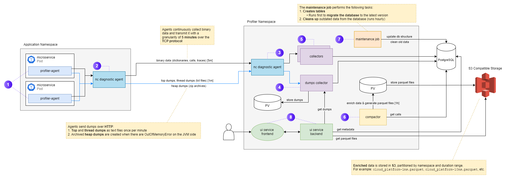

### Components

#### 1. profiler-agent

Performance data is collected on the Java application side using `profiler-agent`.
It connects as a Java agent, saves the data from the application into a cache for a few milliseconds
and sends it further. These data include:

a. Dumps sent over HTTP(S):

* **Top** and **thread** dumps as text files that are sent once per minute

* ZIP archived **heap** dumps that are created when there are OutOfMemoryError on the JVM side

b. TCP binary protocol:

* Includes dictionaries, calls, traces

* Agents continuously collect binary data and transmit it with a granularity of 5 minutes

* For more information about binary protocol see [profiler agent](../agent/profiler_agent.md)

#### 2. nc-diagnostic-agent (on the application side)

Although agents can send data directly to the CDT server,
the recommended method is to use an `nc diagnostic agent` that is deployed in the same namespace
as the profiled applications.
It acts as a proxy through which all performance data passes to the CDT server.
It stores the configuration for connecting to the CDT server, for TLS, etc.

#### 3. nc-diagnostic-agent (on the CDT server side)

Sent performance data is received at the CDT server's only entry point, the `nc diagnostic agent`.
It separates this data and transmits it:

a. Dumps to `dumps collector` services

b. Binary data to `collector` services

#### 4. dumps-collector

The `dumps collector` performs several functions:

a. Saves the collected dumps to a persistent volume attached to it

b. Saves metadata about what is saved to PostgreSQL

c. To optimize storage, ZIP archives top and thread dumps every hour

d. Cleans outdated data older than 2 weeks old

#### 5. collector

The `collector` service parses the received binary data and temporarily stores it in the PostgreSQL database.

#### 6. compactor

The `compactor` service:

a. Takes performance data from PostgreSQL once an hour,
   enriches it and generates parquet files temporarily stored in persistent volume,
   which are later stored in S3 compatible storage

* Enriched data stored in S3 is partitioned by namespace and duration range.

  For example: `cloud_platform-1ms.parquet`, `cloud_platform-10ms.parquet`, etc.

b. Updates metadata in PostgreSQL about the generated file, its lifetime, etc.

#### 7. maintenance-job

The `maintenance job` performs the following tasks:

a. During updates migrates PostgreSQL structure to the new version

b. Removes old data from PostgreSQL and S3

c. Creates temporary tables in PostgreSQL

#### 8. ui-service

The `ui service` consists of frontend and backend parts:

a. Frontend part sends requests to the backend part and displays the results to the user.

b. Backend part:

* Gets metadata from PostgreSQL
* Gets parquet files from S3 and returns performance data from them
* Takes dumps from dump collectors

### Data Flow

#### profiler-agent configuration

The performance data collected by the `profiler-agent` is sent to the `nc-diagnostic-agent` within the same namespace.  
To enable this data transfer, the `profiler-agent` must be configured with the following environment variables:

<!-- TODO: We'll be using different variable names - don't forget to update them here accordingly. -->
* `NC_DIAGNOSTIC_MODE`: Enables diagnostic mode. Supported values are `off`, `dev`, or `prod`.
* `NC_DIAGNOSTIC_AGENT_SERVICE`: Specifies the destination service for performance data (e.g., `nc-diagnostic-agent`).

For more information on how to configure `profiler-agent`, see this [guide](../../public/add-cdt-agent.md).

---

#### profiler-agent and data it sends

The `profiler-agent` consists of two main components:

* **`diagtool`** — a Go-based utility that runs in **daemon mode** and performs the following tasks:

  * **Every minute**, it collects top and thread dumps and sends them over **HTTP(S)** to the CDT Server  
    (via `nc-diagnostic-agent` acting as a proxy). The data is eventually stored in the PV dumps-collector.

    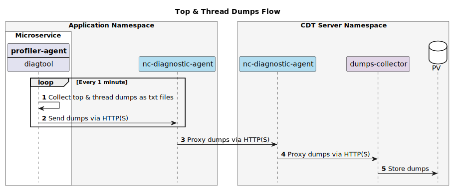

  * **Approximately every 20 seconds**, it checks for newly generated heap dumps in a predefined directory,  
    compresses them, and sends them over **HTTP(S)** to the CDT Server, also passing through the `nc-diagnostic-agent`  
    and into the PV dumps-collector.

    > When an `OutOfMemoryError` occurs, the JVM automatically generates a heap dump if it has been configured to do so.
`diagtool` monitors the designated directory and uploads any new dumps.

    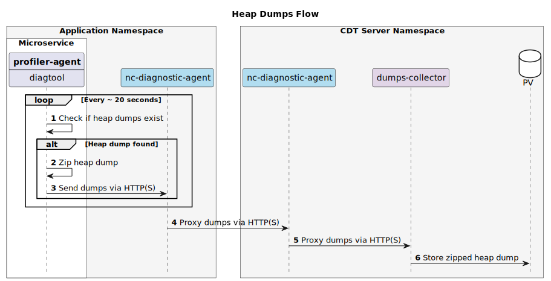

* **Java agent** — a standard Java agent attached to the JVM.  
  It collects performance data and temporarily stores it in a **ring buffer**.  
  The binary data (e.g., **dictionaries**, **calls**, **traces**) is then sent to the CDT Server  
  over **TCP** (using port `1715` or `1717` for TLS), passing through the `nc-diagnostic-agent`, which acts as a proxy.

  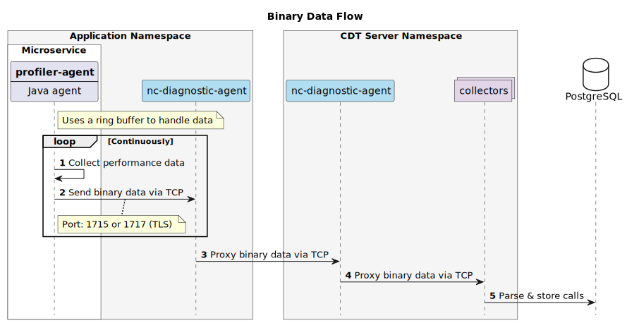

---

#### Dumps Collector

The dumps-collector is responsible for receiving, indexing, storing, archiving, and allowing users to download dumps.

---

**1. Receiving and storing dumps**  
The dumps-collector receives dump data from profiler-agents via the `nc-diagnostic-agent`.  
All incoming dumps are stored in a mounted persistent volume (PV).

---

**2. Indexing dumps**  
Every minute, the dumps-collector scans the PV for newly added dumps.  
It extracts metadata (e.g., type, size, creation time) and stores it in PostgreSQL.

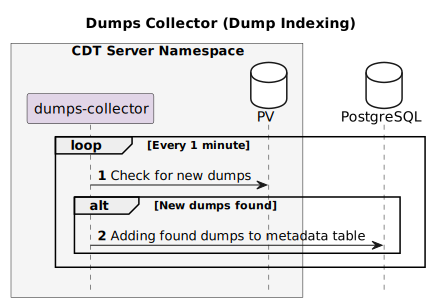

---

**3. Archiving top/thread dumps**  
Every hour, the dumps-collector searches for folders containing top and thread dumps older than two hours.  
These folders are zipped, and the corresponding entries in PostgreSQL are updated to indicate they are archived.

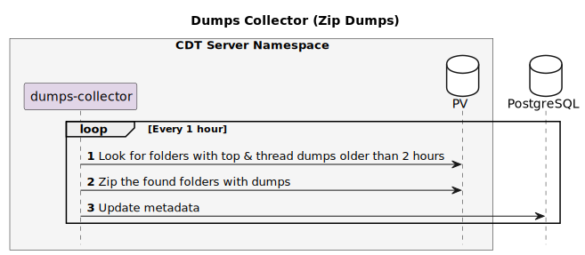

---

**4. Removing expired dumps**  
Once a day, the dumps-collector queries PostgreSQL for dumps that have exceeded their configured TTL.  
It updates their status to `removing`, then deletes the corresponding files from PV and removes their metadata from PostgreSQL.

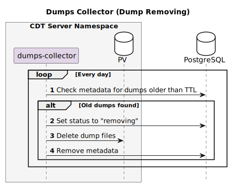

---

**5. Allowing users to download dumps**

* **Top & Thread dump requests**  
  When a user clicks the "Download" button for a specific pod, the dumps-collector receives filter parameters,  
  queries PostgreSQL for matching metadata, and locates relevant files in PV.  
  Both archived and raw dumps that match the filters are collected and sent as a single archive to the user.

  > The download request is routed through a Kubernetes Ingress, which directs the request to the dumps-collector service.

  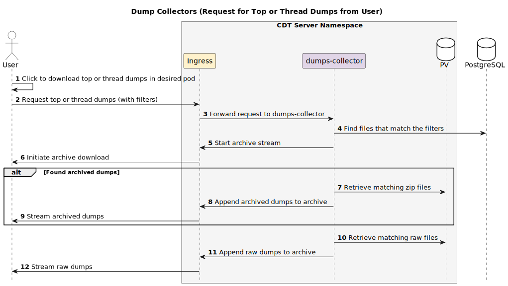

* **Heap dump requests**  
  When a user clicks the download button for a specific heap dump,  
  the dumps-collector uses provided filters to locate the dump via metadata in PostgreSQL.  
  Once found, the archive is retrieved from PV and returned to the user.

  > As with top/thread dumps, the download request is routed via the Kubernetes Ingress directly to the dumps-collector service.

  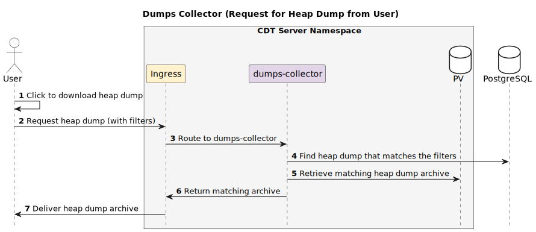

---

#### Collectors

TODO: Add this section

---

#### Compactor

The `compactor` is a service that runs once every hour and performs compaction of **calls** into Parquet files.  
It operates by querying PostgreSQL and saving the results to an S3-compatible storage.

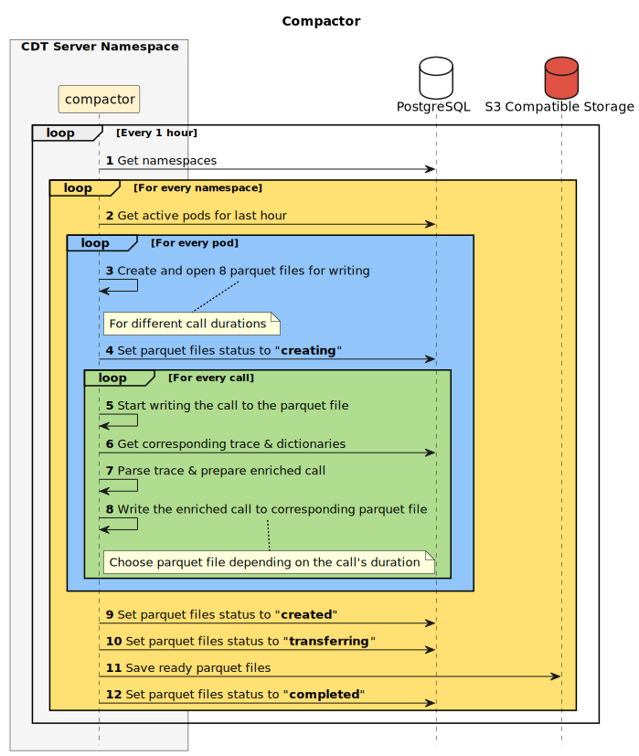

---

**1. Namespace and Pod Discovery**

* Every hour, the compactor queries **PostgreSQL** to retrieve a list of namespaces.
* For each namespace, it queries for **pods** that were active in the last hour.

---

**2. Parquet File Preparation**

* For each active pod, the compactor creates and opens **8 Parquet files** for writing.  
  These files correspond to different **call durations** (e.g., `<1ms`, `1–5ms`, `5–10ms`, etc.).

* After creating the files, the compactor updates their status in PostgreSQL to `creating`.

---

**3. Call Processing**

* For each call associated with the pod:
  * The compactor retrieves the corresponding **trace** and **dictionaries** from PostgreSQL.
  * It parses and enriches the call using the trace and dictionaries.
  * The enriched call is written to the appropriate Parquet file depending on its **duration**.

---

**4. Finalization and Upload**

* After all calls have been processed:
  * The compactor updates the status of all Parquet files to `created`.
  * Then it marks them as `transferring` and uploads the files to **S3-compatible storage**.
  * Once the upload is complete, it sets the final status to `completed`.

---

#### Maintenance Job

The **maintenance job** is a background process responsible for keeping the CDT system in a consistent and optimized state.

---

**1. Database migration**  
When the job starts, it checks the structure of the PostgreSQL database.  
If the schema is outdated, the job applies all necessary migrations to bring it to the latest version.

> This step is performed **before** any other CDT services are launched to ensure compatibility.

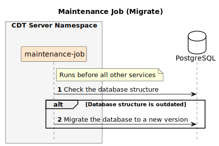

---

**2. Pre-creating temporary tables**  
Every hour, the job creates temporary PostgreSQL tables in advance  
to cover the next two hours.
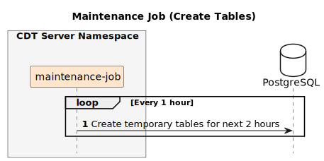

---

**3. Cleaning up expired data**  
Once an hour, the maintenance job performs cleanup:

* **Temporary tables** in PostgreSQL older than their configured TTL are dropped.
* **Metadata** in PostgreSQL older than TTL is deleted.
* **Parquet files** in the S3-compatible storage are removed if their age exceeds TTL.

> Parquet file retention depends on call duration — longer calls are kept longer.

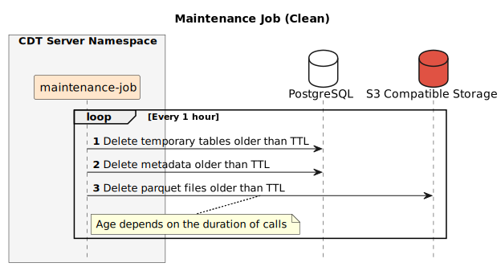

---

#### UI Service

The `ui-service` consists of two components:

* **Frontend** — provides pages for browsing and downloading dumps and viewing calls
* **Backend** — processes requests from the frontend and retrieves data from PostgreSQL and S3-compatible storage

---

**1. Calls page**  
The user can request **calls data**

TODO: Add this section

---

**2. Dumps pages**

The process differs slightly between **top/thread dumps** and **heap dumps**.

---

**Top & Thread Dumps**

* The user first navigates to the top/thread dumps page in the frontend,
selecting the desired namespaces and services.  
  The backend uses these filters to query PostgreSQL for matching namespaces and services.  
  The results are returned and displayed as a list in the frontend.

  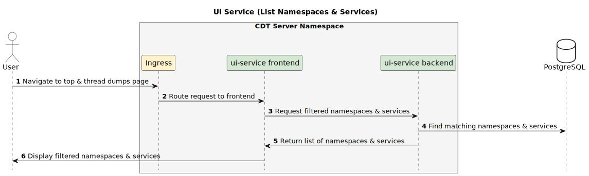

* Once the user sees the list of services, they can expand a specific one to view matching pods.  
  This triggers another request to the backend, which again queries PostgreSQL based on filters  
  and returns a list of relevant pods displayed beneath the service.

  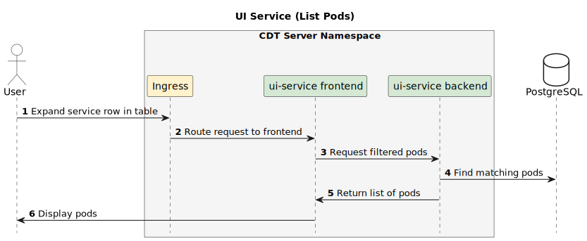

* When the user clicks the download button for a specific dump type in a selected pod,  
  the request goes directly to the `dumps-collector` via **Kubernetes Ingress**,  
  without involving the `ui-service`. See the relevant section for details:
  ["Allowing users to download dumps"](#dumps-collector)

---

**Heap Dumps**

* The user opens a separate **heap dumps** page in the frontend.  
  A request is sent to the backend, which filters heap dump metadata in PostgreSQL  
  and returns the matching results to be displayed in a list.

  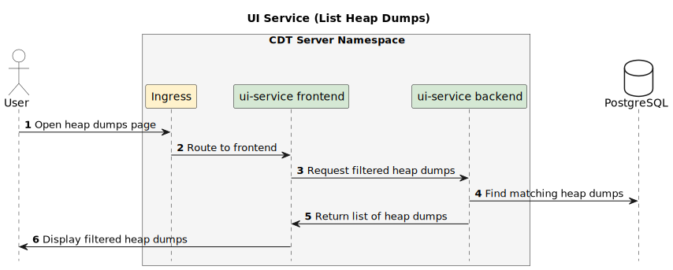

* If the user clicks the download button for a heap dump,  
  the request goes directly to the `dumps-collector` via **Kubernetes Ingress**,  
  without involving the `ui-service`. See the relevant section for details:
  ["Allowing users to download dumps"](#dumps-collector)
