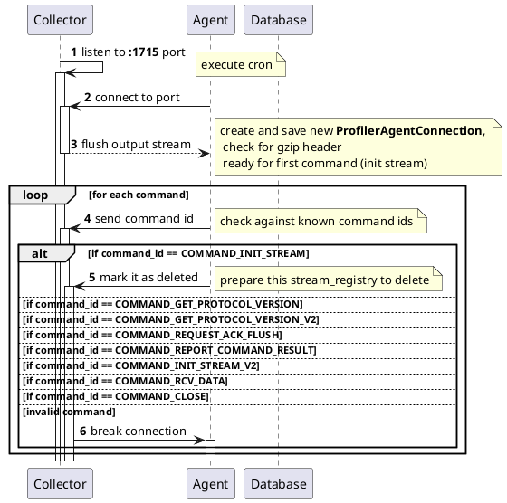

# Collector <-> Agent protocol

## Implementation details

* Read from socket by `EndlessSocketInputStream` (it blocks while waiting for next bytes from client)
* Protocol is bi-directional (so we use both `InputStream` and `OutputStream` from socket, check `FieldIO` class)

### Parameters

| constant                      | value | description                |
|-------------------------------|-------|----------------------------|
| PLAIN_SOCKET_READ_TIMEOUT     | 30 s  |                            |
| DATA_BUFFER_SIZE              | 1 kb  | BufferedOutputStream, etc. |
| PLAIN_SOCKET_RCV_BUFFER_SIZE  | 8 kb  | socket receive             |
| PLAIN_SOCKET_SND_BUFFER_SIZE  | 8 kb  | socket send                |

### Connection

* flush for output will be initiated by dumper every 5? sec (see`MAX_FLUSH_INTERVAL_MILLIS=5s` and `FLUSH_CHECK_INTERVAL_MILLIS=500ms`)

### Chunks

* forbidden to send chunk with length more than `DATA_BUFFER_SIZE`
* due to compression chunk size in DB ~`250-350` bytes (at least `80` bytes for other columsn: `podName`, `seqId`)

```java
int COMPRESSOR_BUFFER_SIZE = getPropertyOrEnvVariable(ENV_STREAM_CHUNK_SIZE, 3072);
```

* size of disk pages in cassandra is typically 4 KB,
* size of query to insert into stream_chunks is approx 350 bytes

## Diagram



## Header

### Fields

0x00: command id (first byte)

| field type  | short  | description                                          |
|-------------|--------|------------------------------------------------------|
| field       | *[F]*  | *[4 bytes]*`length` + *[length bytes]*`val`          |
| string      | *[S]*  | *[4 bytes]*`length` + *[length bytes]*`val`          |
| long        | *[L]*  | *[8 bytes]*`val`                                     |
| int         | *[I]*  | *[4 bytes]*`val`                                     |
| uuid        | *[U]*  | *[8 bytes]*`mostSigBits` + *[8 bytes]*`leastSigBits` |

### Commands

* check `0x00` (first byte) to retrieve command id:

| command id                      | value   | description                                    |
|---------------------------------|---------|------------------------------------------------|
|                                 | `-1`    | EOF                                            |
| COMMAND_INIT_STREAM             | `0x01`  | pod sends the pod info                         |
| COMMAND_INIT_STREAM_V2          | `0x15`  | pod sends the incoming stream info             |
| COMMAND_RCV_DATA                | `0x02`  | pod sends a data chunk for stream              |
| COMMAND_CLOSE                   | `0x04`  | pod wants to close the connection              |
| COMMAND_GET_PROTOCOL_VERSION    | `0x08`  | pod asks for collector's  protocol version     |
| COMMAND_GET_PROTOCOL_VERSION_V2 | `0x14`  | pod sends client info and its protocol version |
| COMMAND_REQUEST_ACK_FLUSH       | `0x11`  | pod asks for commands from UI/collector        |
| COMMAND_REPORT_COMMAND_RESULT   | `0x13`  | pod sends the command result                   |

#### COMMAND_INIT_STREAM

> pod sends the pod info

| n | direction | type    | field              | description |
|---|-----------|---------|--------------------|-------------|
| 1 | from      |  string | `namespaceName`    |             |
| 2 | from      |  string | `microserviceName` |             |
| 3 | from      |  string | `podName`          |             |

#### COMMAND_INIT_STREAM_V2

Actions:

* Pod sends the incoming stream info
* Collector closes prev stream if opened

| n  | direction | type   | field                        | description                          |
|----|-----------|--------|------------------------------|--------------------------------------|
| 1  | from      | string | `streamName`                 |                                      |
| 2  | from      | int    | `requestedRollingSequenceId` |                                      |
| 3  | from      | int    | `resetRequired`              | `>0` if should delete old dictionary |
| A4 | to        | uuid   | `null`                       | send `null` in case of exception     |
| A5 | to        | flush  |                              |                                      |
| B4 | to        | uuid   | `handleId`                   | new uuid for                         |
| B5 | to        | long   | `rotationPeriod`             | see below                            |
| B6 | to        | long   | `requiredRotationSize`       | see below                            |
| B7 | to        | int    | `rollingSequenceId`          |                                      |
| B8 | to        | flush  |                              |                                      |

Details about fields:

> **rotationPeriod**
>
> `0` If stream is not required to rotation for stream (dictionary, params)
>
> Otherwise, rotate at least 3 times during retention period (or every hour).
> Use `STREAM_ROTATION_PERIOD` with priority, if defined.

and:

> **requiredRotationSize**
>
> `0` If stream is not required to rotation for stream (dictionary, params)
>
> Otherwise, rotate at least `10` times during retention period (or every `2 MB`)

#### COMMAND_RCV_DATA

| n  | direction | type  | field                     | description                        |
|----|-----------|-------|---------------------------|------------------------------------|
| 1  | from      | uuid  | `handleId`                |                                    |
| 2  | from      | field | `contentLength` + `data`  |                                    |
| A3 | to        | byte  | `ACK_ERROR_MAGIC` (`-1`)  | in case of exception, close socket |

* `call sendCommands(false)` (see below) at the end

#### COMMAND_CLOSE

> close connection and opened chunk streams

#### COMMAND_GET_PROTOCOL_VERSION

| n | direction | type   | field              | description |
|---|-----------|--------|--------------------|-------------|
| 1 | to        | long   | `PROTOCOL_VERSION` | `100505L`   |
| 2 | to        | flush  |                    |             |

#### COMMAND_GET_PROTOCOL_VERSION_V2

| n | direction | type   | field                   | description |
|---|-----------|--------|-------------------------|-------------|
| 1 | from      | long   | `clientProtocolVersion` |             |
| 2 | from      | string | `podName`               |             |
| 3 | from      | string | `microserviceName`      |             |
| 4 | from      | string | `namespaceName`         |             |
| 5 | to        | long   | `PROTOCOL_VERSION_V2`   | `100605L`   |
| 6 | to        | flush  |                         |             |

#### COMMAND_REQUEST_ACK_FLUSH

| n | direction | type   | field              | description |
|---|-----------|--------|--------------------|-------------|
| 1 | to        | flush  |                    |             |

* update active time for pod (`touchPod`)
* `call sendCommands(true)` (see below) at the end

#### COMMAND_REPORT_COMMAND_RESULT

| n | direction | type  | field               | description |
|---|-----------|-------|---------------------|-------------|
| 1 | from      | uuid  | `executedCommandId` |             |
| 1 | from      | byte  | `success`           |             |

* save command result to DB

## sendCommands(bool)

> **Disabled now!**
>
> Don't query DB, always send `0` instead of `commands.size()`

| n  | direction | type   | field             | description                                       |
|----|-----------|--------|-------------------|---------------------------------------------------|
|    | [DB]      |        | `queryCommands()` | retrieve waiting commands from (**disabled**)     |
| 1  | to        | byte   | `commands.size()` | (should be less `100`)  (**disabled**: sends `0`) |
| 2  | to        | flush  |                   | flush socket if `sendCommands(true)`              |
| N1 | to        | uuid   | `commandId`       |                                                   |
| N2 | to        | string | `command`         |                                                   |

> So after each `COMMAND_RCV_DATA` and `COMMAND_REQUEST_ACK_FLUSH` the agent should get `0` as ack from collectors
> before any other responses

## Example

TBD
