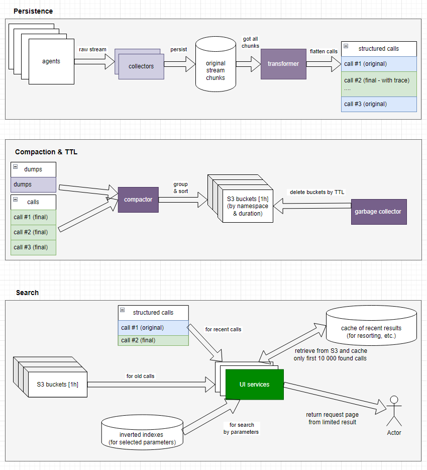
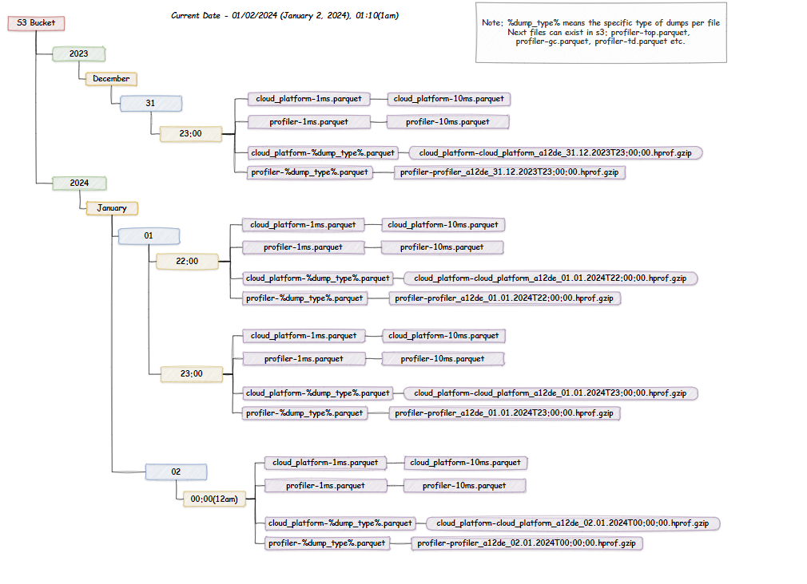
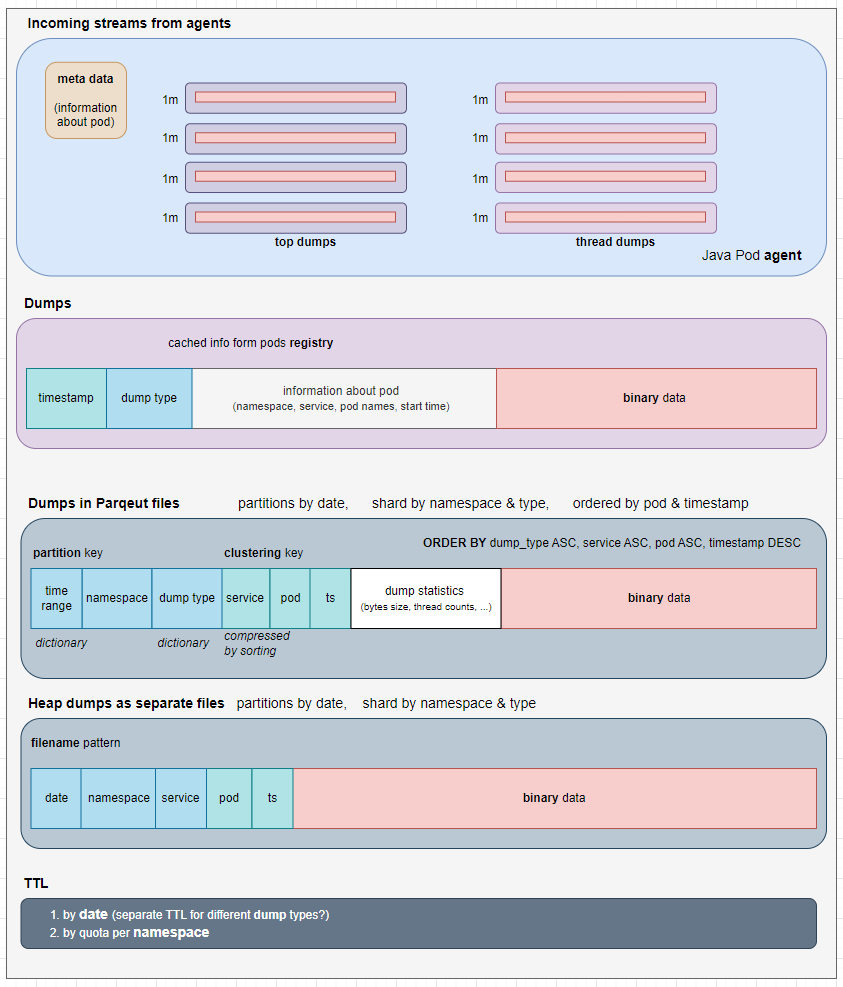
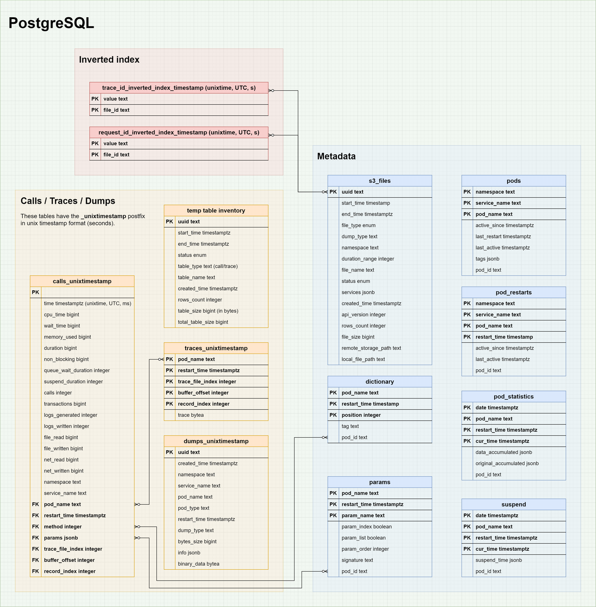

# Low-level design document (API) for profiler data structure

Document describes low-level design for new S3 storage.

---

- [Low-level design document (API) for profiler data structure](#low-level-design-document-api-for-profiler-data-structure)
  - [How it works in general](#how-it-works-in-general)
  - [S3 Storage](#s3-storage)
    - [Directory structure in S3 storage](#directory-structure-in-s3-storage)
    - [Apache Parquet Files Schema](#apache-parquet-files-schema)
      - [Calls](#calls)
        - [Trace Id (Index in CallParquet struct above)](#trace-id-index-in-callparquet-struct-above)
      - [Dumps](#dumps)
      - [Dump types description](#dump-types-description)
    - [Indexes In JSON Format](#indexes-in-json-format)
  - [PostgreSQL Schema](#postgresql-schema)
    - [Schema](#schema)
    - [Metadata](#metadata)
      - [S3 Files Table](#s3-files-table)
      - [Pods](#pods)
      - [Pods Restart](#pods-restart)
      - [Dictionary](#dictionary)
      - [Params](#params)
    - [Calls / Traces](#calls--traces)
      - [Calls temp table](#calls-temp-table)
      - [Trace temp table](#trace-temp-table)
      - [Dumps](#dumps-1)
      - [Temporary Inventory Table](#temporary-inventory-table)
    - [Inverted Indexes](#inverted-indexes)
  - [Appendix A. Duration ranges](#appendix-a-duration-ranges)
  - [Appendix B. SQL Files](#appendix-b-sql-files)

## How it works in general



## S3 Storage

### Directory structure in S3 storage

At the top level, there is a main bucket for storing all the data collected by the profiler that needs to be saved.
Inside the bucket, directories are organized by year -> month -> day -> hour.
Data is partitioned by namespace + duration_range and sorting by pod and timestamp.
More about partitioning by namespace and duration in [Appendix A](#appendix-a-duration-ranges)

> Note: %dump_type% means the specific type of dumps per file.
> Next files can exist in s3: profiler-top.parquet, profiler-gc.parquet, profiler-td.parquet etc.



### Apache Parquet Files Schema

#### Calls


| Field name          | Go Type           | Parquet Type | Description                                                             |
|---------------------| ----------------- | ------------ | ----------------------------------------------------------------------- |
| time                | int64             | int64        | timestamp (Unix time, UTC, ms)                                          |
| cpu_time            | int64             | int64        | actual time for work (in ms)                                            |
| wait_time           | int64             | int64        | common wait (in ms)                                                     |
| memory_used         | int64             | int64        | memory used by method (in bytes)                                        |
| duration            | int32             | int32        | duration of method (in ms)                                              |
| non_blocking        | int64             | int64        | ???                                                                     |
| queue_wait_duration | int32             | int32        | wait in queue (in ms)                                                   |
| suspend_duration    | int32             | int32        | specifies the server hang-up duration (time spend for GC, for example). |
| calls               | int32             | int32        | count of internal calls                                                 |
| transactions        | int64             | int64        | count of DB transactions                                                |
| logs_generated      | int32             | int32        | bytes generated by method                                               |
| logs_written        | int32             | int32        | bytes written by method                                                 |
| file_read           | int64             | int64        | disk bytes read by method                                               |
| file_written        | int64             | int64        | disk bytes written by method                                            |
| net_read            | int64             | int64        | I/O read by method (in bytes)                                           |
| net_written         | int64             | int64        | I/O write by method (in bytes)                                          |
| namespace           | string            | byte_array   | namespace name                                                          |
| service_name        | string            | byte_array   | service name                                                            |
| pod_name            | string            | byte_array   | pod name                                                                |
| restart_time        | int64             | int64        | restart timestamp for pod (Unix time, UTC, ms)                          |
| method              | string            | byte_array   | method name from dictionary                                             |
| params              | map[string]string | map          | multiple chunks of parameter values                                     |
| trace_index         | string            | byte_array   | link to offset to corresponding trace file position                     |
| trace               | string            | byte_array   | binary data of call tree from corresponding trace file                  |

```go
type CallParquet struct {
  Time              int64                      `parquet:"name=time, type=INT64"`
  CpuTime           int64                      `parquet:"name=cpuTime, type=INT64"`
  WaitTime          int64                      `parquet:"name=waitTime, type=INT64"`
  MemoryUsed        int64                      `parquet:"name=memoryUsed, type=INT64"`
  Duration          int32                      `parquet:"name=duration, type=INT32"`
  NonBlocking       int64                      `parquet:"name=nonBlocking, type=INT64"`
  QueueWaitDuration int32                      `parquet:"name=queueWaitDuration, type=INT32"`
  SuspendDuration   int32                      `parquet:"name=suspendDuration, type=INT32"`
  Calls             int32                      `parquet:"name=calls, type=INT32"`
  Transactions      int64                      `parquet:"name=transactions, type=INT64, convertedtype=UINT_64"`
  LogsGenerated     int32                      `parquet:"name=logsGenerated, type=INT32"`
  LogsWritten       int32                      `parquet:"name=logsWritten, type=INT32"`
  FileRead          int64                      `parquet:"name=fileRead, type=INT64, convertedtype=UINT_64"`
  FileWritten       int64                      `parquet:"name=fileWritten, type=INT64, convertedtype=UINT_64"`
  NetRead           int64                      `parquet:"name=netRead, type=INT64, convertedtype=UINT_64"`
  NetWritten        int64                      `parquet:"name=netWritten, type=INT64, convertedtype=UINT_64"`
  Namespace         string                     `parquet:"name=namespace, type=BYTE_ARRAY, convertedtype=UTF8, encoding=PLAIN_DICTIONARY"`
  ServiceName       string                     `parquet:"name=serviceName, type=BYTE_ARRAY, convertedtype=UTF8, encoding=PLAIN_DICTIONARY"`
  PodName           string                     `parquet:"name=podName, type=BYTE_ARRAY, convertedtype=UTF8, encoding=PLAIN_DICTIONARY"`
  RestartTime       int64                      `parquet:"name=restartTime, type=INT64"`
  Method            string                     `parquet:"name=method, type=BYTE_ARRAY, convertedtype=UTF8, encoding=PLAIN_DICTIONARY"`
  Params            map[string]ParamsValueList `parquet:"name=params, type=MAP, convertedtype=MAP, keytype=BYTE_ARRAY, keyconvertedtype=UTF8" `
  Index             string                     `parquet:"name=index, type=BYTE_ARRAY, convertedtype=UTF8"`
  Trace             string                     `parquet:"name=bytearray, type=BYTE_ARRAY"`
}

type ParamsValueList struct {
  ValueList []string `parquet:"name=valueList, type=LIST, valuetype=BYTE_ARRAY, valueconvertedtype=UTF8"`
}

```

##### Trace Id (Index in CallParquet struct above)

Trace id is a combination of three fields:
trace_file_index
buffer_offset
record_index

When saved in Parquet, concatenation into a string will occur using an underscore.

#### Dumps



| Field name   | Go Type | Parquet Type | Description        |
|--------------| ------- | ------------ | ------------------ |
| namespace    | string  | byte_array   | namespace name     |
| service_name | string  | byte_array   | service name       |
| pod_name     | string  | byte_array   | pod name           |
| restart_time | int64   | int64        |                    |
| pod_type     | string  | byte_array   | java/go            |
| dump_type    | string  | byte_array   | type of dumps      |
| time         | int64   | int64        |                    |
| bytes_size   | int32   | int32        |                    |
| params       | string  | byte_array   | json with metadata |
| binary_data  | string  | byte_array   |                    |

```go
type DumpParquet struct {
  Time        int64             `parquet:"name=time, type=INT64"`
  Namespace   string            `parquet:"name=namespace, type=BYTE_ARRAY, convertedtype=UTF8"`
  ServiceName string            `parquet:"name=serviceName, type=BYTE_ARRAY, convertedtype=UTF8"`
  PodName     string            `parquet:"name=podName, type=BYTE_ARRAY, convertedtype=UTF8"`
  RestartTime int64             `parquet:"name=restartTime, type=INT64"`
  PodType     string            `parquet:"name=podType, type=BYTE_ARRAY, convertedtype=UTF8"`
  DumpType    string            `parquet:"name=dumpType, type=BYTE_ARRAY, convertedtype=UTF8"`
  BytesSize   int64             `parquet:"name=bytesSize, type=INT64"`
  Info        map[string]string `parquet:"name=params, type=MAP, convertedtype=MAP, keytype=BYTE_ARRAY, keyconvertedtype=UTF8, valuetype=BYTE_ARRAY, valueconvertedtype=UTF8"`
  BinaryData  string            `parquet:"name=binaryData, type=BYTE_ARRAY"`
}
```

#### Dump types description

| Dump Type   | App type | Description                                                                                         | Binary Data Example                                                                                                                                    |
| ----------- | -------- | --------------------------------------------------------------------------------------------------- | ------------------------------------------------------------------------------------------------------------------------------------------------------ |
| td          | java     | Thread Dumps are the snapshot of java thread states.                                                | [example.td.txt](dump_examples0231219T061734UTC.td.txt)                                                                                                |
| top         | java     | TOP dumps contain information about currently running processes and their parameters                | [example.top.txt](dump_examples0231219T061734UTC.top.txt)                                                                                              |
| gc          | java     | Garbage Collection logs contain records for the memory availability and memory deallocation         | [example.gc.log](dump_examples0231219T062953UTC.gc.log)                                                                                                |
| alloc       | go       |                                                                                                     | [example.alloc.pprof](dump_exampleslarm-saver-v1-c46d5c56f-8cws4_10.130.12.151_8080_20231220T051319UTC_d075a446-5528-410b-a0f3-6cc6e5b69390.pprof)     |
| goroutine   | go       |                                                                                                     | [example.goroutine.pprof](dump_exampleslarm-saver-v1-c46d5c56f-8cws4_10.130.12.151_8080_20231220T010013UTC_d69a3494-c206-41e0-9e77-58a7d9fb64ad.pprof) |
| heap        | go       |                                                                                                     | [example.heap.pprof](dump_exampleslarm-saver-v1-c46d5c56f-8cws4_10.130.12.151_8080_20231220T010015UTC_bae5652e-1739-4cc7-869f-04d72bd801de.pprof)      |
| profile     | go       |                                                                                                     | [example.profile.pprof](dump_exampleslarm-saver-v1-c46d5c56f-8cws4_10.130.12.151_8080_20231220T010021UTC_61fd823d-8dcd-4a93-9e56-6f83558ed0c8.pprof)   |
| thread_info | java     | Result(json) of thread analysis baced on thread and top dumps, (not implemented, planned in 2024.3) |                                                                                                                                                        |

Note: heap dumps from java application could take 500Mb-1Gb, so it has to store separatly as independent file.

### Indexes In JSON Format

- additional inverted index in S3

## PostgreSQL Schema

This section describes the schema of tables in Postgres that will be used for various purposes.
Below you will find all the tables with descriptions and parameters, as well as a picture of the overall schema.

### Schema



Note: SQL file for schema in [Appendix B](#appendix-b-sql-file).
It is not a final version, there are not inverted index tables

### Metadata

This section describes metadata tables.

#### S3 Files Table

This table stores data on all files stored on S3.
The table has no relationships with other tables and stores information necessary for searching and debugging.

| Name                | Type        | Description                                                         |
| ------------------- | ----------- | ------------------------------------------------------------------- |
| uuid                | text        |                                                                     |
| start_time          | timestamptz |                                                                     |
| end_time            | timestamptz |                                                                     |
| file_type           | enum        | calls or traces                                                     |
| dump_type           | text        | (for dump) dump type (go or java application)                       |
| namespace           | text        |                                                                     |
| duration_range      | integer     | (for calls) duration range for calls (in ms)                        |
| file_name           | text        |                                                                     |
| status              | enum        | file status                                                         |
| services            | jsonb       | services that are in the file                                       |
| created_time        | integer     | File creation time                                                  |
| api_version         | text        | version of our design                                               |
| rows_count          | integer     | the number of rows per file                                         |
| file_size           | bigint      | file size                                                           |
| remote_storage_path | text        |                                                                     |
| local_file_path     | text        | link to PV, where we will store temporary file before send it to S3 |

Note: status can have 5 different values:

- creating
- created
- transferring
- completed
- to_delete

Which service will use that table:

- write - compactor
- read - compactor, maintenance job, ui-service
- clean - maintenance job

#### Pods

  // TODO add desc

| Name         | Type        | Description |
| ------------ | ----------- | ----------- |
| namespace    | text        |             |
| service_name | text        |             |
| pod_name     | text        |             |
| active_since | timestamptz |             |
| last_restart | timestamptz |             |
| last_active  | timestamptz |             |
| tags         | jsonb       |             |
| pod_id       | text        |             |

Which service will use that table:

- write - collector
- read - collector, compactor
- clean - k8s job

#### Pods Restart

  // TODO add desc

| Name         | Type        | Description |
| ------------ | ----------- | ----------- |
| pod_name     | text        |             |
| restart_time | timestamptz |             |
| namespace    | text        |             |
| service_name | text        |             |
| pod_id       | text        |             |
| active_since | timestamptz |             |
| last_active  | timestamptz |             |

Which service will use that table:

- write - collector
- read - collector, compactor
- clean - k8s job

#### Dictionary

// TODO add desc

| Name         | Type        | Description |
| ------------ | ----------- | ----------- |
| pod_name     | text        |             |
| restart_time | timestamptz |             |
| position     | integer     |             |
| pod_id       | text        |             |
| tag          | text        |             |

Which service will use that table:

- write - TBD
- read - TBD
- clean - k8s job

#### Params

// TODO add desc

| Name         | Type        | Description |
| ------------ | ----------- | ----------- |
| pod_name     | text        |             |
| restart_time | timestamptz |             |
| param_name   | text        |             |
| param_index  | boolean     |             |
| param_list   | boolean     |             |
| param_order  | integer     |             |
| signature    | text        |             |
| pod_id       | text        |             |

Which service will use that table:

- write - TBD
- read - TBD
- clean - k8s job

### Calls / Traces

These tables will be created by k8s job 3 hours in advance

#### Calls temp table

Collector has to store each call from agent for 5 minutes in Postgres tables and compactor will work with that data.
That table contains a reference to Trace table for futher combine all call data and save it to .parquet file.

| Field name          | Type        | Description                                  |
| ------------------- | ----------- | -------------------------------------------- |
| time                | timestamptz | you can find descriptions in [Calls](#calls) |
| cpu_time            | bigint      |                                              |
| wait_time           | bigint      |                                              |
| memory_used         | integer     |                                              |
| duration            | integer     | ms                                           |
| non_blocking        | bigint      |                                              |
| queue_wait_duration | integer     |                                              |
| suspend_duration    | integer     |                                              |
| calls               | integer     |                                              |
| transactions        | bigint      |                                              |
| logs_generated      | integer     |                                              |
| logs_written        | integer     |                                              |
| file_read           | bigint      |                                              |
| file_written        | bigint      |                                              |
| net_read            | bigint      |                                              |
| net_written         | bigint      |                                              |
| namespace           | text        |                                              |
| service_name        | text        |                                              |
| pod_name            | text        |                                              |
| restart_time        | timestamptz |                                              |
| method              | integer     |                                              |
| params              | jsonb       |                                              |
| trace_file_index    | integer     |                                              |
| buffer_offset       | integer     |                                              |
| record_index        | integer     |                                              |

Which service will use that table:

- Write - collector
- Read - compactor
- Create/Delete - k8s job

#### Trace temp table

That table contains traces for calls.

| Name             | Type        | Description |
| ---------------- | ----------- | ----------- |
| pod_name         | text        |             |
| restart_time     | timestamptz |             |
| trace_file_index | integer     |             |
| buffer_offset    | integer     |             |
| record_index     | integer     |             |
| trace            | bytea       |             |

Which service will use that table:

- Write - collector
- Read - compactor
- Create/Delete - k8s job

#### Dumps

Table contains different dumps from java and go applications

| Name         | Type        | Description |
|--------------|-------------| ----------- |
| uuid         | serial      |             |
| created_time | timestamptz |             |
| namespace    | text        |             |
| service_name | text        |             |
| pod_name     | text        |             |
| pod_type     | text        |             |
| restart_time | timestamptz |             |
| dump_type    | text        |             |
| bytes_size   | bigint      |             |
| info         | jsonb       |             |
| binary_data  | bytea       |             |

Which service will use that table:

- Write - collector
- Read - compactor
- Create/Delete - k8s job

#### Temporary Inventory Table

| Name             | Type        | Description                                                     |
| ---------------- | ----------- | --------------------------------------------------------------- |
| uuid             | text        |                                                                 |
| start_time       | timestamptz | (start of the time range) time range for which it contains data |
| end_time         | timestamptz | (end of the time range) time range for which it contains data   |
| status           | enum        |                                                                 |
| table_type       | text        |                                                                 |
| table_name       | text        | full table name to use                                          |
| created_time     | timestamptz |                                                                 |
| rows_count       | integer     |                                                                 |
| table_size       | bigint      |                                                                 |
| total_table_size | bigint      |                                                                 |

Note: status can have 5 different values:

- creating
- ready
- persisting
- persisted
- to_delete

Which service will use that table:

- Write - k8s job<br>
- Read - collector, ui-service(?? not in first realese), k8s job<br>
- Clean - k8s job

### Inverted Indexes

There will be many tables to store the inverted index for each parameter of the params filed from call structure.
Shard by parameter name, partitions by date.

The tables contain all possible values for the parameter and file ID on S3 where the parameter appears with that value.
The tables implement a many-to-many relationship, where the primary key will be the pair of value + file Id.

| Name    | Type    | Description        |
| ------- | ------- | ------------------ |
| value   | any     | value of parameter |
| file_id | integer | file ID on S3      |

Which service will use that table:

- Write - compactor<br>
- Read - compactor, ui-service<br>
- Clean - k8s job


## Appendix A. Duration ranges

The following set of duration ranges has been defined that will be used for compaction:<br/>

| timerange            | short number (in ms)     | short name | file name example            |
| -------------------- | ------------------------ | ---------- | ---------------------------- |
| \`0\` - \`1ms\`      | 1                        | 0ms        | cloud_profiler_0ms.parquet   |
| \`1ms\` - \`10ms\`   | 10                       | 1ms        | cloud_profiler_1ms.parquet   |
| \`10ms\` - \`100ms\` | 100                      | 10ms       | cloud_profiler_10ms.parquet  |
| \`100ms\` - \`1s\`   | 1000                     | 100ms      | cloud_profiler_100ms.parquet |
| \`1s\` - \`5s\`      | 5000                     | 1s         | cloud_profiler_1s.parquet    |
| \`5s\` - \`30s\`     | 30000                    | 5s         | cloud_profiler_5s.parquet    |
| \`30s\` - \`90s\`    | 90000                    | 30s        | cloud_profiler_30s.parquet   |
| \`>90s\`             | a number more than 90000 | 90s        | cloud_profiler_90s.parquet   |

The file name and its contents will follow the formula:<br>

> file_name = namespace + duration_range(short name) from the list above

The name of each file will contain the upper boundary of the range, which includes all calls in the file.

## Appendix B. SQL Files

SQL files containing database schema descriptions required for implementing the functionality of the new service:

- [cdt_schema.sql](sources/cdt_schema.sql)
- [tables_templates.sql](sources/tables_template.sql)
