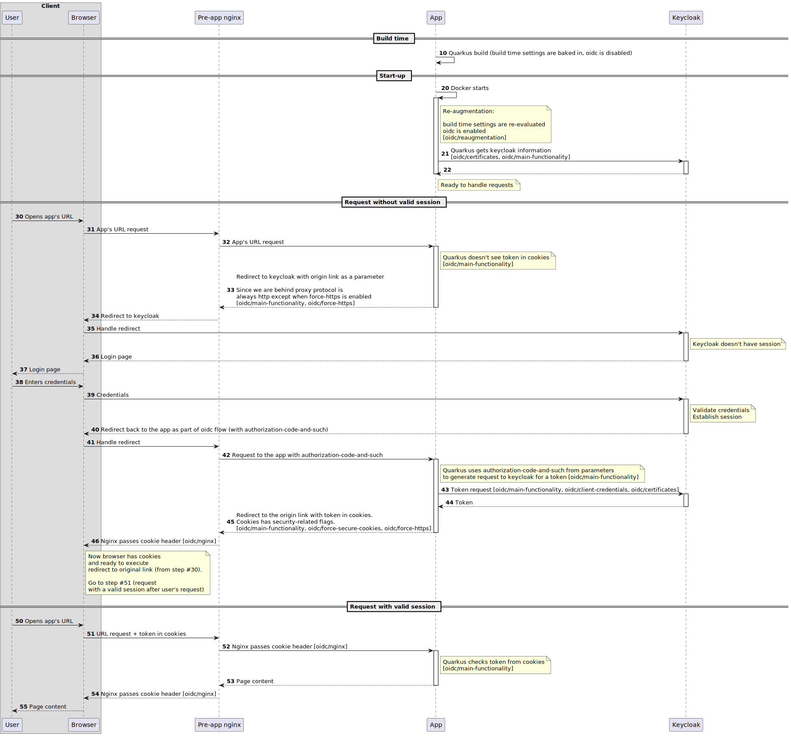

This document provides information about OpenID Connect (OIDC) implementation for profiler developers. It could
be useful for review, troubleshooting, development.

# Table of Content

<!-- TOC -->
* [OpenID Connect Authentication details](#openid-connect-authentication-details)
* [Table of Content](#table-of-content)
* [Introduction](#introduction)
* [Parts of the functionality](#parts-of-the-functionality)
  * [Main functionality](#main-functionality)
  * [Client credentials](#client-credentials)
  * [Certificates](#certificates)
  * [Re-augmentation](#re-augmentation)
  * [Nginx](#nginx)
  * [Force https](#force-https)
  * [Force secure cookies](#force-secure-cookies)
* [How does it work](#how-does-it-work)
* [Known issues/limitations](#known-issueslimitations)
  * [No role check](#no-role-check)
  * [Link parameters are lost after redirect](#link-parameters-are-lost-after-redirect)
* [Interop](#interop)
<!-- TOC -->

# Introduction

OIDC is a well-known authentication protocol. It is a standard way of doing authentication in a secure manner. Without
it profiler couldn't be safe to use because HTTP Basic is not good enough due to multiple shortcomings.

Quarkus supports it although we need use/configure additional functionality.  

# Parts of the functionality

This functionality consists of different parts. Here is a list

* oidc/main-functionality
* oidc/client-credentials
* oidc/certificates
* oidc/reaugmentation
* oidc/nginx
* oidc/force-https
* oidc/force-secure-cookies

Those labels will be used in the following section to show when they are active

## Main functionality

To enable OIDC functionality in any Quarkus application we have to add jar library (oidc extension) in pom.xml and
specify `quarkus.oidc.enabled` property

For configuration refer to [Installation guide](https://github.com/Netcracker/qubership-profiler-backend/-/blob/master/docs/public/installation.md#ui-service)

## Client credentials

It's part of OIDC configuration. It's required since authentication code flow requires them. They are stored in
Kubernetes secret `ui-oidc-client-secret`

## Certificates

There are two times when request is performed from quarkus app to identity provider: during start-up and when
authorization-code-and-stuff is exchanged for token. If https protocol is used (as it should be) then certificates are
required. Existing capabilities of base docker image is used but we need to pass them.

They are stored in Kuberentes config map `ui-extra-certificates`.

## Re-augmentation

There is a concept of build-time properties in quarkus. By default they are immutable at runtime and must be set
at build time.

There is a concept of re-augmentation which will solve the above issue, if we want to change build-time property like
OIDC enabled flag value.

Packaging type is also changed to `mutable-jar` to allow re-augmentation.

## Nginx

Nginx limits HTTP request size. Default value of 4k works for requests without OIDC. OIDC adds approx 6k of cookies with
JWT tokens. In order for nginx to allow that there is an annotation

`nginx.ingress.kubernetes.io/proxy-buffer-size: 12k`

Without it there will be 503 error when user is authenticated

## Force https

When quarkus generates redirect link it doesn't take into account https termination at reverse proxy. In order to force
it there is `QUARKUS_OIDC_AUTHENTICATION_FORCE_REDIRECT_HTTPS_SCHEME` setting which is automatically set when https is
detected in IdP URL

## Force secure cookies

Even with https-mode being forced quarkus doesn't set `secure` flag for cookies. In order to force that there is
`QUARKUS_OIDC_AUTHENTICATION_COOKIE_FORCE_SECURE` setting which is automatically set when https is detected in IdP URL

# How does it work

# Known issues/limitations

## No role check

It's a limitation of existing implementation. There is no role check thus any user from the configured identity provider
could access UI.

Steps to reproduce:

1. Make sure user on identity provider doesn't have any roles
2. Login to the profiler

ER: access is denied because there are no roles
AR: access is granted

## Link parameters are lost after redirect

Issue is related to URL fragment (parameters after hash). For example it is reproduced with call details but not with
main window with applied filters.

Steps to reproduce:

1. Find direct link to a call
2. Make sure session is not present (e.g. via incognito tab)
3. Go to that link
4. Provide credentials

ER: you are logged in and forwarded to the link for step #1
AR: you are logged in but all parameters of the link are lost and there is indefinite "Loading..." process

# Interop

OIDC is not supposed to be used together with HTTP Basic. If both are enabled then only HTTP Basic is active
