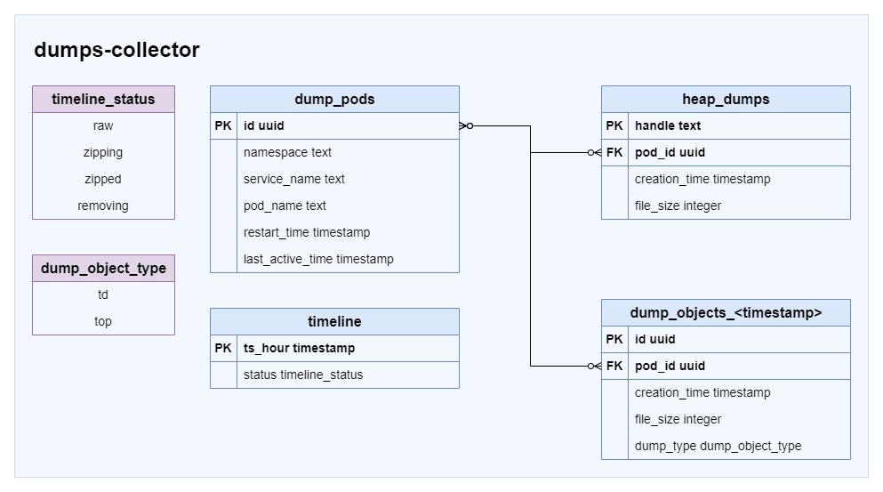

# Dump cache design

## Possible schemas



### Pods

Pod table contains information about pods, that have some dumps.

```sql
CREATE TABLE IF NOT EXISTS dump_pods (
    id uuid NOT NULL,
    namespace text  NOT NULL,
    service_name text  NOT NULL,
    pod_name text  NOT NULL,
    restart_time timestamp  NOT NULL,
    last_active timestamp,
    PRIMARY KEY (id)
);
```

Where:

* `id` - internal unique identificator of the pod;
* `namespace` - namespace;
* `service_name` - service name;
* `pod_name` - pod name;
* `restart_time` - time, when pod was started
(this information is taken from pod timestamp);
* `last_active` - time, when last dump for this pod was generated;

### Heap dumps

Heap dumps table contains information about heap dumps existed in PV.

```sql
CREATE TABLE IF NOT EXISTS heap_dumps (
    handle text NOT NULL,
    pod_id uuid  NOT NULL,
    creation_time timestamp  NOT NULL,
    file_size integer  NOT NULL,
    PRIMARY KEY (handle)
);
```

Where:

* `handle` - unique identificator of the heap dump, that is generated
from pod name with timestamp and dump number;
* `pod_id`  - id of the pod (see pods table);
* `creation_time` - time, when dump is generated;
* `file_size` - file size of the dump;

### Timeline

Timeline tables is needed to understand, what hours are processed by static-collector.

```sql
CREATE TABLE IF NOT EXISTS timeline (
    ts_hour timestamp  NOT NULL,
    status timeline_status  NOT NULL,
    PRIMARY KEY (ts_hour)
);
```

Where:

* `ts_hour` is time in hours;
* `status` is statuses for files:
  * `raw` - dumps for this hour exist in PV;
  * `zipping` - dumps for this hour are packing;
  * `zipped` - dumps for this hour are packed;
  * `removing` - dumps for this hour are removing;

### Td/top dumps

Td/top dumps tables contain information about td/top dumps.
Those tables contain the most information,
because every pod creates td and top dumps every minute = 40320 rows
for every pod for 14 days.
So tables should be splited by creation time hour
(every hour information is stored in timeline table).

There are different approaches, how to collect information about td/top dumps.
The best of them should be chosen based on the speed of different operations.

#### Information about every dump

This approach assumes, that separate row is created in the table for every
td/top dump. Using this information, it's easy to calculate file path in PV,
so it improves download procedure, but requires more space for db.

```sql
CREATE TABLE IF NOT EXISTS dump_objects_{{.TimeStamp}}  (
  id uuid,
  pod_id uuid,
  creation_time timestamp,
  file_size integer,
  dump_type text,
  PRIMARY KEY (id)
  FOREIGN KEY (pod_id) REFERENCES pods(id)
);
```

Where:

* `id` - internal unique identificator of dump;
* `pod_id` - id of the pod (see pods table);
* `creation_time` - time, when dump is generated;
* `file_size`  - file size of the dump;
* `dump_type` - `td` or `top`;

#### Summary statistic per minute

Td/top dumps are collected every minute for every pod, so it's easy to collect
summary statistic for specific time. This approach requires less db size and
is faster for insert/calculate statistic operations, but it's not possible to
calculate file paths for download operation. So in that case we have to search
files in PV.

```sql
CREATE TABLE IF NOT EXISTS dump_objects_{{.TimeStamp}}  (
  id uuid,
  pod_id uuid,
  time_minute timestamp,
  summary_td_file_size integer,
  summary_top_file_size integer,
  PRIMARY KEY (id)
  FOREIGN KEY (pod_id) REFERENCES pods(id)
);
```

Where:

* `id` - internal unique identificator of dump information;
* `pod_id` - id of the pod (see pods table);
* `time_minute` - time, truncated per minute;
* `summary_td_file_size` - size sum for td dumps for minute;
* `summary_top_file_size` - size sum for top dumps for minute;

#### Summary statistic for specific time range

This approach collects minimum information about collected td/top dumps and can
be used for statistic only. But here we lose information about changes in file
sizes.

```sql
CREATE TABLE IF NOT EXISTS dump_objects_{{.TimeStamp}}  (
  id integer,
  pod_id integer,
  date_from timestamp,
  date_to timestamp,
  td_file_count integer,
  top_file_count integer,
  td_file_size integer,
  top_file_size integer,
  PRIMARY KEY (id)
  FOREIGN KEY (pod_id) REFERENCES pods(id)
);
```

Where:

* `id`  - internal unique identificator of dump information;
* `pod_id` - id of the pod (see pods table);
* `date_from` - time of the first dump for pod;
* `date_to` - time of the last dump for pod;
* `td_file_count` -count of td dumps for pod and time range;
* `top_file_count` -count of top dumps for pod and time range;
* `td_file_size` - summary td dumps file size for pod and time range;
* `top_file_size` - summary td dumps file size for pod and time range;

## Maintenance operations

### Insert operation

Application has special cron task, that runs every minute. During this task,
application goes into PV and check updates for specific time
(e.g. for last 5 munites).

Every new file path and file size for this period is collected into special
array. Namespace, service name, pod name, ts, dump type are parsed from
file paths.

* For td/top dumps:

  ```bash
  <base-dir>/<namespace>/<year>/<month>/<day>/<hour>/<minute>/<second>/<service-and-pod-name-with-ts>/<creation-date>.<type>.txt`
  ```

  E.g.:

  ```bash
  /diag/diagnostic/profiler-examples/2024/06/27/14/27/04/spring-boot-3-undertow-5cbcd847d-l2t7t_1719318147399/20240627T142704.td.txt
  ```

* For heap dumps:

  ```bash
  <base-dir>/<namespace>/<year>/<month>/<day>/<hour>/<minute>/<second>/<service-and-pod-name-with-ts>/<creation-date>.hprof.zip
  ```

  E.g.:

  ```bash
  /diag/diagnostic/profiler-examples/2024/06/27/14/27/04/spring-boot-3-undertow-5cbcd847d-l2t7t_1719318147399/20240627T142704.hprof.zip
  ```

Then:

1. If it's a new hour, the new `raw` record will be added in timeline table and
new temporary dump table will be
created for this hour;
2. If it's a new pod, the new record will be added in pods table;
3. If it's a old pod, it's `last_active` field should be updated;
4. If it's a heap dump, the new record will be added in `heap_dumps` table;
5. If it's a td/top dump, the new record will be added in temporary `dump_objects`
table for this hour;

### Packing operation

Application should know, when hour information is packed, so packing hour to
zip archive should be moved to this application.

Application has special cron task, that runs every hour. During this task,
application calculates the hour, that should be packed in this operation
and then:

1. The hour status in `timeline` table is changed to `zipping`;
2. The hour directory is packed to zip archive for every namespace in PV;
3. The hour status in `timeline` table is changed to `zipped`;
4. The hour directory is removed for every namespace in PV;

### Cleanup operation

Application should know, when hour information is removed, so cleanup algorithm
should be moved to this application. Aplication has special cron task, that
runs every day. During this task, application calculates hours, that should be
removed and then for every hour:

1. The hour status in `timeline` record is changed to `removing`;
2. The `dump_objects` table for hour is removed;
3. The heap dumps from `heap_dumps` table with `creation_time` older then hour
are removed;
4. The pods with `last_active` older then hour are removed;
5. The hour record is removed from `timeline` table;

### Initialization

In case, if DB does not exist or in case of some problems in DB
(e.g. it was locked for some reason), application should be able to recreate it
and rescan all PV.

It should be done as background process after start, and it should not fail
readiness/liveness probes(application should be able to process requests).
For that application has special task, that is triggered on empty db or
manually, that goes into PV and runs insert operation for every directory
(from the newest ones to the oldest ones).

## Rest API

Application implements already existed API in UI service.

### Search operation

Request: POST `/esc/javaServices`

Parameters from body:

* `dateFrom`;
* `dateTo`;
* `podFilter`;

Application should do following steps:

1. Parse podFilter to sql filter for pods table;
2. Get pod ids from pods table according specified filter;
3. For every hours from dateFrom to dateTo:
    3.1. Calculate dumps_object for hour;
    3.2. Get summary request for specified information with complex request;
4. Sum all summaries per pod for hours;
5. Find heap dumps information from heap_dumps table for needed pods;

Expected reponse: list of objects:

* `namespace`;
* `serviceName`;
* `podName`;
* `activeSinceMillis`;
* `firstSampleMillis`;
* `lastSampleMillis`;
* `dataAtStart`;
* `dataAtEnd`;
* `currentBitrate`;
* `downloadOptions`:
  * `typeName`: `gc`, `top`, `td`;
  * `uri`;
* `onlineNow`;
* `heapDumps`:
  * `time`;
  * `handle`;
  * `file_size`;

Process:

1. Parse `podFilter` to sql filter for pods table;
2. Get pod ids from pods table according specified filter;
3. For every hours from `dateFrom` to `dateTo`:
    3.1. Calculate `dumps_object` for hour;
    3.2. Get summary request for specified information with complex request,
    e.g. for schema 3:

    ```sql
    SELECT pod_id,
        MIN(creation_time) AS date_from,
        MAX(creation_time) AS date_to,
        SUM(td_file_size) AS td_file_size,
        SUM(top_file_size) AS top_file_size
    FROM dump_object
    WHERE creation_time BETWEEN ? AND ? AND pod_id IN ?
    GROUP BY pod_id
    ```

4. Sum all summaries per pod for hours;
5. Find heap dumps information from `heap_dumps` table for needed pods;
6. Return result:
   * `namespace`, `service_name`, `pod_name` `activeSinceMillis` from pod
   information;
   * `firstSampleMillis`, `lastSampleMillis` are `date_from`, `date_to`;
   * `dataAtStart` as 0;
   * `dataAtEnd` as sum of `td` and `top` file sizes;
   * `currentBitrate` as
   `(dataAtEnd - dataAtStart) / (date_to_seconds - date_from-seconds)`;
   * `onlineNow` is true, if pod `last_dump_time` is too old
   (more than minute);
   * `heapDumps` as found dumps information;

Notes:

1. `onlineNow` is a cind of scratch, because `last_dump_time` can be old
because of different reasons;
2. `dataAtStart` is always 0 in current realization;
3. `downloadOptions` is always the same:
`[{typeName: "td", uri: "/esc/download"},{typeName: "top", uri: "/esc/download"}]`;

### Download top/td dumps

Request: GET `/esc/download`

Query parameters:

* `dateFrom`;
* `dateTo`;
* `type`;
* `namespace`;
* `service`;
* `podName` with ts;

For schema 3:

1. Get the list of timeline hours, that are affected
(from `dateFrom` to `dateTo`);
2. For every affected timeline hours:
  2.1. Find All dumps information for specified parameters from table;
  2.2. Check, that hour is zipped (from `timeline` status):
    * If yes:
      2.2.1. Open zip archive for hour;
      2.2.2. Calculate path inside this archive for every dump;
      2.2.3. Open files;
    * If no:
      2.2.4. O Calculate path iin PV for every dump;
3. Pack all found files to archive and return to user;

For schema 2:

1. Get the list of timeline hours, that are affected
(from `dateFrom` to `dateTo`);
2. For every affected timeline hours:
  2.1. Check, that hour is zipped (from `timeline` status):
    * If yes:
      2.1.1 Open zip archive for hour;
      2.1.2. Go through **all** files in the archive and find files for needed
      pod and type;
      2.1.3. Open filtered files;
    * If no:
      2.1.4. Go through **all** files in hour directory and find files for
      needed pod and type;
      2.1.5. Open filtered files;
3. Pack all found files to archive and return to user;

### Download heap dumps

Request: GET `/esc/downloadHeapDump`

* `podName` looks like not used;
* `handle`

Process:

1. Find heap dump with `handle` from `heap_dumps` table;
2. Calculate hour from `creation_time`;
3. Check if hour is zipped (from `timeline` table):
    * If yes:
      3.1. Caluclate path inside zip archive from `creation_time` and pod;
      3.2. Open file in archive;
    * If no:
      3.3. Caluclate path in PV from `creation_time` and pod;
      3.4. Open file;
4. Return to user;

## Points to discussion

1. **Major**: A lot of data to return for 6000 pods: return in pages or
print error
  1.1. Check, how much data should be returned and return information to user,
  if it's not possible to return all information;
  1.2. Protection from overloading;
